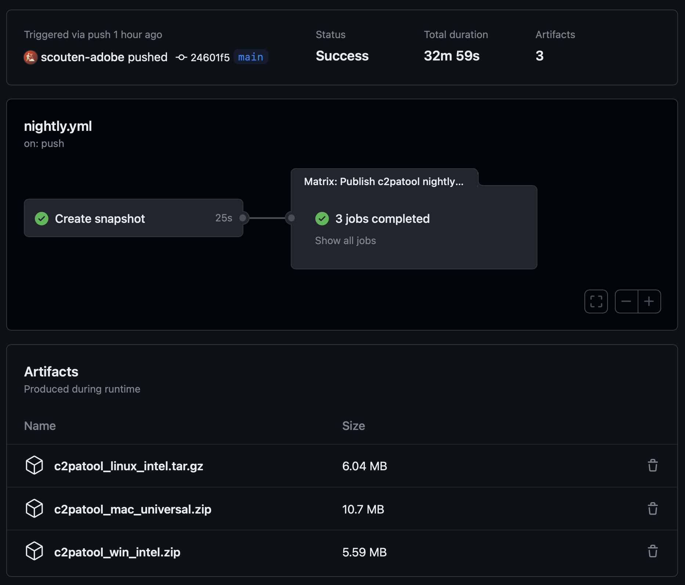

# About c2patool nightly builds

Interim binaries are generated every day around 0530 UTC (i.e. overnight for our US-based team) and are available for roughly two weeks thereafter. These can be helpful for testing purposes.

## Finding nightly builds

Start by clicking on the [Actions](https://github.com/contentauth/c2patool/actions) tab for the repo and then click on the ["Nightly build" entry on the left side](https://github.com/contentauth/c2patool/actions/workflows/nightly.yml).

In this screen, you'll see a history of recent nightly builds, something like this:


Click on the build description (for example, "Use v2 of rust-cache" in this list). That will lead to a summary screen similar to the following:



In the **"Artifacts"** section at the bottom are archives containing the `c2patool` binary and relevant sample files.

Note that each build contains a unique build number. If you file a bug against a nightly version, we would very much appreciate it if you would include that version ID:

```
$ c2patool --version
c2patool 0.6.2-nightly+2023-08-29-24601f5
```

This build number contains the date of the nightly version and the commit ID (from `main` branch) that was built.

## Important notes about nightly builds

* CAI team members may occasionally trigger "nightly" builds at other times of the day if there are particularly interesting changes that we need to test.
* Nightly builds of `c2patool` are built with the latest available nightly build of `c2pa-rs`. Typically this is a snapshot of `c2pa-rs` taken at 0500 UTC (i.e. very shortly before the corresponding `c2patool` build).
* This repo contains a `nightly` branch which contains the code for the latest build that was triggered (typically the Cargo.toml and Cargo.lock changes). This branch is force-pushed by the nightly build process; you should not rely on its contents and should not target this build for any pull requests.
