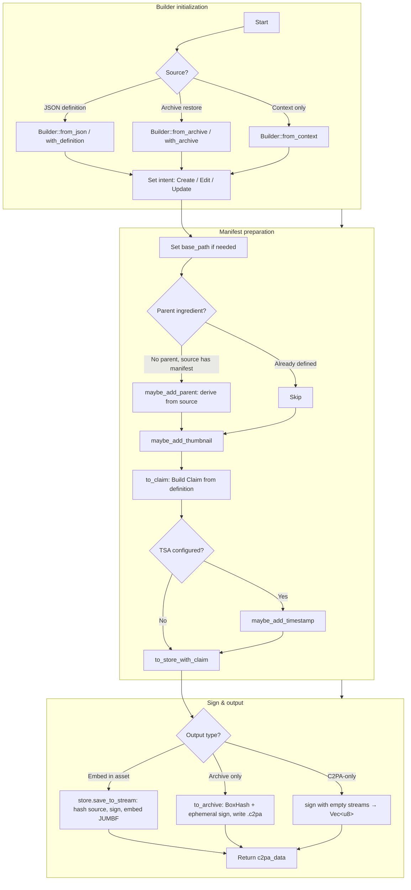

A short history of the CAI Rust SDK

It all started in the fall of 2019 when the CAI was founded. The spec had not been written yet, nor had the C2PA organization been formed.

All the history has been lost since Adobe decided to delete all older emails, but I'll recall what I can remember.

As some of us gathered to work on an SDK, we decided to use Rust. We had no experience in Rust, but it fit the bill as for working on all platforms, being safe and very performant. We wanted to have an open source library, but our first goal was to make something work in Photoshop as a plugin. 

Photoshop had no support for Rust and plugin panels had to written in Javascript. So we started by creating a local server that we could call from the panel. We called server the CAI_HELPER and it had to be installed along with Photoshop by Creative Cloud.

We had a REST API that could read an asset as an ingredent and another to sign a manifest using a manifest definition. Originally the plan was to use CBOR to communicate between the plugin and the helper with HTTP calls. But the version of CBOR that the plugin could support proved to be far too slow to use. So we switched to a combination of JSON and binary files. The ingredient API would be passed a file path and it would return a JSON ingredient report that could reference a thumbnail and a c2pa binary store. It was up to Photoshop to decide where and how to store this information. The photoshop plugin also had to keep track of any image editing actions and save them somewhere. After a user exported a file, Photoshop would construct a JSON post with actions and ingredients and and send the request along with a path to the exported file to the helper. The helper would then process the request by generating a claim from the JSON and ingredients, sign it and embed it into the exported file.

This was our first pre-release, originally written before the C2PA 1.0 spec existed.

For the first open source release, we had not yet put together a public API, so I scrambled to write a wrapper layer around the lower level apis exposing the ManifestStore, Manifest, Ingredients & etc as the primary API. These were generated from the logic that made the REST API for the service, and corresponded to how Photoshop and c2patool interacted with the api via json and files. It was a quick attempt to get something out for opensource without cornering us.

There were a number of problems with the Rust API since everything was read/write, but there were many things could only be read and other things that could only be written. So you just had to know which apis to use when. We also ran into a problem of having a very large API space to port to other languages. It was the language porting issue that led us to create a much simpler API with just a Builder, a Reader and a Signer. The Builder was write only for generating manifest stores and the Reader was Read only. The builder accepted a JSON manifest definition and would pull in resources from file references. Since wasm and others could not always use file references, we created a whole set of memory based apis and I added a resource store that could use content in memory or in files.

Timeline
claim_lib / cai-toolkit  https://git.corp.adobe.com/cai-archive/cai-toolkit/ June 2020
Cai-helper - aug 14, 2020  - claim-lib submodule
switch to cai-toolkit submodule - sep 2020
Oct 22 2020 claim_tool & thumbnails
wasm support nov 19 2020
cbor support jun 2021
png support jun 2021
cose support aug 2021
cai-toolkit -> c2pa-toolkit june 3 2021 https://git.corp.adobe.com/cai-archive/c2pa-toolkit/
max beta pre-release Oct 2021
c2pa-rs May 23 2022  opensource SDK (archived c2pa-toolkit) 
c2patool published May 26 2022

Todo tasks:
Deprecate a large number of now obsolete Rust APIS (and the corresponding other language apis)
Sync CAWG signing and validation
CAWG callback signing in open source

Settings loading and updating from remtote sources
Deprecate Dynamic Assertions and post_validate apis
Major pass updating unit tests using deprecated APIs
Content Credentials API
Split Asset_io into a separate crate
Mini XMP

Structure of SDK
store, claim, assertion, jumbf_io, asset_io, assertions

Manifest, Ingredient, ManifestResport, ResourceStore 

Builder, Reader

Mistakes:

We should never have attempted to support open source as a primary api.
I shouldn't have created a higher level api with abstractions like Ingredients and resources.
We should have exported Maurice's claim and Store apis as is.
The focus should have been lower level all along to encourage any api user to know the spec and deal with changes
No abstractions beyong what is minimally required.

I've been working in startup mode trying to say yes to every request.
Too focused on writing code and not on being a an architect defining requirements.
Not focused enough on building process.
I should have transitioned to being a full time internal consultant, meeting with adobe teams to determine what they need.
The lack of my playing the role I should have done has led to all kinds of internal trouble for the team.
I've been accusational and pointing fingers at others.
I've been ingorning urgent requests in favor of my own perceived and un communicated priorities.
I should have kept my full focus on the internal adobe tools and make open source a secondary, as we can, kind of effort at best.
I should not have introduced the Builder Reader model at all, nor any of the other abstraction layers I've done.

