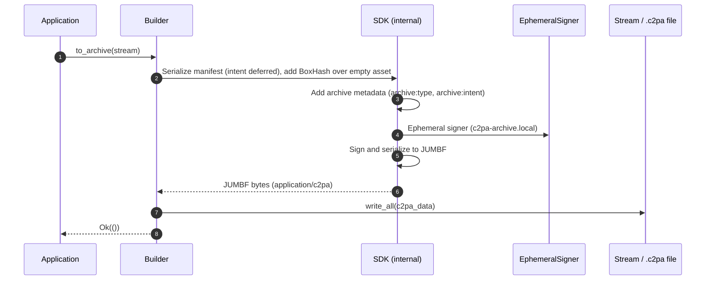
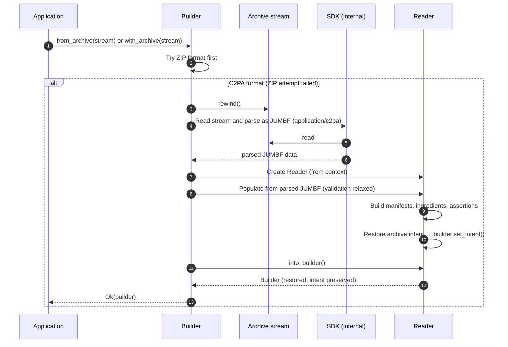

# Working stores and archives

Many workflows need to pause and resume manifest authoring or reuse previously validated ingredients. _Working stores_ and _C2PA archives_ (or simply _archives_) provide a standard way to save and restore the state of a [`Builder`](https://docs.rs/c2pa/latest/c2pa/struct.Builder.html).

## Overview

Working store and archive refer to the same underlying concept:

- **Working store** emphasizes the editable state — the *content* of the editable C2PA manifest state (claims, ingredients, assertions) that has not yet been bound to a final asset. Typically used when describing "work in progress" manifest data.
- **C2PA archive** emphasizes the saved, portable representation — the *artifact* of the saved bytes (in a `.c2pa` file or stream) resulting from a working store that you can read back to restore a `Builder`.

An archive is simply a working store serialized as a standard manifest store. Both use the JUMBF format (`application/c2pa`). The specification does not define a separate archive format; the SDK reuses the standard manifest store format:

- The same format is used for **signed manifests** (bound to an asset), **working stores** (saved for later editing), and **saved ingredients** (validated once, reused in other manifests).
- An archive can be embedded in files, stored as sidecars (for example, `.c2pa`), or kept in a database or cloud storage.
- Working stores use placeholder signatures (`BoxHash`) and an ephemeral certificate — they are not intended for public trust.
- Validate an ingredient once, then reuse it without re-validation.

> [!NOTE]
> You can't merge working stores by calling `with_archive()` repeatedly.

## Archive types

The SDK has two kinds of archives:

| Archive type | Written by | Read by | Purpose |
|---|---|---|---|
| **Builder archive** | [`Builder::to_archive`](https://docs.rs/c2pa/latest/c2pa/struct.Builder.html#method.to_archive) | [`Builder::with_archive`](https://docs.rs/c2pa/latest/c2pa/struct.Builder.html#method.with_archive) / [`from_archive`](https://docs.rs/c2pa/latest/c2pa/struct.Builder.html#method.from_archive) | Save and restore the full `Builder` state |
| **Ingredient archive** | [`Builder::write_ingredient_archive`](https://docs.rs/c2pa/latest/c2pa/struct.Builder.html#method.write_ingredient_archive) | [`Builder::add_ingredient_from_archive`](https://docs.rs/c2pa/latest/c2pa/struct.Builder.html#method.add_ingredient_from_archive) | Export a single validated ingredient for reuse |

Both kinds use the same `application/c2pa` JUMBF format and are distinguished by an `archive:type` field (`"builder"` or `"ingredient"`) in the internal `org.contentauth.archive.metadata` assertion.

## API summary

### Builder archives

| Operation | API | Description |
|-----------|-----|-------------|
| Save | [`builder.to_archive(&mut stream)`](https://docs.rs/c2pa/latest/c2pa/struct.Builder.html#method.to_archive) | Writes the working store to `stream`. |
| Restore (new `Builder`) | [`Builder::from_archive(stream)`](https://docs.rs/c2pa/latest/c2pa/struct.Builder.html#method.from_archive) | Creates a default-context `Builder` from the archive. |
| Restore (existing context) | [`builder.with_archive(stream)`](https://docs.rs/c2pa/latest/c2pa/struct.Builder.html#method.with_archive) | Loads the archive into an existing `Builder`, preserving its context. |

### Ingredient archives

| Operation | API | Description |
|-----------|-----|-------------|
| Export ingredient | [`builder.write_ingredient_archive(&ingredient_id, &mut stream)`](https://docs.rs/c2pa/latest/c2pa/struct.Builder.html#method.write_ingredient_archive) | Writes a single ingredient as a JUMBF archive. Requires `builder.generate_c2pa_archive = true`. |
| Import ingredient | [`builder.add_ingredient_from_archive(&mut stream)`](https://docs.rs/c2pa/latest/c2pa/struct.Builder.html#method.add_ingredient_from_archive) | Reads an ingredient archive and adds it to the builder. |

### Legacy ZIP archive format

The SDK also supports an older ZIP format containing `manifest.json`, `resources/`, and `manifests/`. This format is written when `builder.generate_c2pa_archive = false` (see [Settings](context-settings.md)). The default is the JUMBF format (`generate_c2pa_archive = true`). Restore (`with_archive` / `from_archive`) accepts both: it tries ZIP first, then falls back to JUMBF.

> [!NOTE]
> `write_ingredient_archive` only supports the JUMBF format. It returns `Error::BadParam` if `generate_c2pa_archive` is not `true`.

## Using intents with archives

[Intents](intents.md) work naturally with archives. The intent set on a `Builder` is preserved in the archive and automatically restored when the archive is loaded. At `sign()` time, the restored intent triggers the same automatic behavior as if the intent had been set directly — deriving the parent ingredient from the source stream, adding `c2pa.opened` or `c2pa.created` actions, and so on.

```rust
// Set an intent and archive without needing a parent ingredient yet.
let mut builder = Builder::from_definition(r#"{"title": "My Edit"}"#)?;
builder.set_intent(BuilderIntent::Edit);
builder.to_archive(&mut archive_stream)?;

// Later: restore and sign. The parent ingredient is auto-derived from the asset stream.
let mut builder = Builder::default().with_archive(archive_stream)?;
// builder.intent() == Some(BuilderIntent::Edit)
builder.sign(&signer, "image/jpeg", &mut source, &mut dest)?;
```

Key points:

- **Parent ingredients are not required at archive time.** For `Edit` and `Update` intents, the parent is auto-derived from the asset stream at `sign()` time, exactly as in a non-archive workflow.
- **The intent is restored on `with_archive()`.** You can override it before signing by calling `set_intent()` again.
- **Actions are not baked at archive time.** `c2pa.opened` and `c2pa.created` are added at `sign()` time based on the restored intent and the actual ingredient map.
- **`Update` intent with archives is unusual.** Update is for immediate metadata-only changes; consider signing directly rather than archiving with Update intent.

## Best practices

1. [**Use intents**](intents.md): Set an intent to get automatic validation and action generation at sign time.
2. [**Archive validated ingredients**](#ingredient-archives): Save expensive validation results and reuse them.
3. [**Use shared context**](context-settings.md): Create a `Context` once, share it across operations.
4. [**Label ingredients**](#link-ingredients-to-actions): Use labels to link ingredients to actions.
5. **Store archives flexibly**: Files, databases, S3, and in-memory all work.

## Examples

- [`sdk/examples/builder_sample.rs`](https://github.com/contentauth/c2pa-rs/blob/main/sdk/examples/builder_sample.rs)
- [`sdk/examples/api.rs`](https://github.com/contentauth/c2pa-rs/blob/main/sdk/examples/api.rs)

Run the builder example:

```bash
cd sdk
cargo run --example builder_sample
```

## How archives work internally

### Saving a builder archive (`to_archive`)

When `Builder::to_archive(stream)` is called:

1. The builder's manifest definition is serialized to a claim. Intent enforcement is deferred — the intent is not applied at this step.
2. A BoxHash assertion over an empty asset is added (placeholder binding).
3. An `org.contentauth.archive.metadata` assertion is added with `archive:type = "builder"` and `archive:intent` (if an intent is set).
4. An ephemeral signer (`c2pa-archive.local`) signs and serializes the claim to JUMBF bytes.
5. The raw JUMBF bytes are written to `stream`.



### Restoring a builder archive (`with_archive` / `from_archive`)

When `Builder::with_archive(stream)` or `from_archive(stream)` is called:

1. ZIP format is tried first. If it succeeds, the builder is reconstructed directly.
2. If ZIP fails, the stream is rewound and parsed as JUMBF `application/c2pa`.
3. A `Reader` is populated from the parsed store. Signature trust checks are relaxed so the ephemeral certificate passes.
4. `Reader::into_builder()` reconstructs a `Builder`. It reads `archive:intent` from the metadata and restores it, and skips `org.contentauth.archive.metadata` itself so it does not appear in the final signed manifest.



### Ephemeral signature and security

Archives use an **ephemeral, self-signed certificate** (`c2pa-archive.local`). This signature provides tamper detection during round-trips but is **not** intended for public trust or content credential verification. The `org.contentauth.archive.metadata` assertion is an internal SDK implementation detail — it is stripped from the builder on restore and never appears in final signed manifests.

Both archive formats sanitize resource identifiers and entry names via `sanitize_archive_path`, which rejects absolute paths, `../` traversal components, and null bytes. This defends against ZIP-slip and similar path traversal attacks.

## Common tasks

### Save and restore a Builder

```rust
// Save
let mut archive = Cursor::new(Vec::new());
builder.to_archive(&mut archive)?;
std::fs::write("work.c2pa", archive.get_ref())?;

// Restore (default context)
let builder = Builder::from_archive(Cursor::new(std::fs::read("work.c2pa")?))?;

// Or restore with a custom, shared context (see: docs/context-settings.md)
let builder = Builder::from_shared_context(&context)
    .with_archive(Cursor::new(std::fs::read("work.c2pa")?))?;
```

### Archive with an intent

```rust
// Archive time: set intent, no parent ingredient required yet.
let mut builder = Builder::default().with_definition(r#"{"title": "My Photo"}"#)?;
builder.set_intent(BuilderIntent::Edit);
builder.to_archive(&mut archive)?;

// Sign time: parent is derived automatically from the source asset stream.
let mut builder = Builder::default().with_archive(archive)?;
builder.sign(&signer, "image/jpeg", &mut source_stream, &mut dest)?;
```

### Ingredient archives

Use `write_ingredient_archive` to export a single validated ingredient for reuse across manifests, and `add_ingredient_from_archive` to import it into a new builder.

```rust
// Export a specific ingredient by label.
let mut ingredient_stream = Cursor::new(Vec::new());
builder.write_ingredient_archive("ingredient_1", &mut ingredient_stream)?;
let ingredient_bytes = ingredient_stream.into_inner();

// Later: import into a different builder.
let mut builder2 = Builder::default().with_definition(r#"{"title": "Composite"}"#)?;
builder2.add_ingredient_from_archive(&mut Cursor::new(ingredient_bytes))?;
builder2.add_action(json!({
    "action": "c2pa.placed",
    "parameters": { "ingredientIds": ["ingredient_1"] }
}))?;
```

`add_ingredient_from_archive` requires a stream produced by `write_ingredient_archive` (tagged with `archive:type = "ingredient"`). For other `application/c2pa` stores, use `add_ingredient_from_stream` or `add_ingredient_from_reader`.

Resources associated with the ingredient (thumbnails, icons) are merged into the builder automatically.

### Override ingredient properties

JSON properties passed to `add_ingredient_from_archive` override values from the archive. This is useful for renaming or re-relating an archived ingredient:

```rust
// add_ingredient_from_archive does not take override JSON directly;
// update the ingredient after adding it:
let ingredient = builder.add_ingredient_from_archive(&mut stream)?;
ingredient.set_title("New Title");
```

### Link ingredients to actions

Use labels to reference ingredients in actions:

```rust
builder.add_action(json!({
    "action": "c2pa.placed",
    "parameters": {
        "ingredientIds": ["ingredient_1"],
    }
}))?;
```

## FAQs

**Can I use both old and new archive formats?**

Yes. Loading an archive (`with_archive` / `from_archive`) automatically detects ZIP or JUMBF format.

**Where should I store archives?**

Anywhere — local files, S3, databases, and in-memory all work.

**Can I have multiple parent ingredients?**

No. Only one parent is allowed. Other ingredients use different relationships (for example, `componentOf`, `inputTo`).

**Does my intent need to be set before archiving?**

No, but setting it is recommended so it is preserved in the archive and automatically restored. You can also set or override the intent after restoring (`builder.set_intent(...)`).

**Can I archive with `Update` intent?**

Technically yes, but it is unusual. `Update` is designed for immediate metadata-only changes with no intermediate step. Consider signing directly instead.

**Is an archive safe to share publicly?**

No. Archives use an ephemeral self-signed certificate and are not intended for public consumption. They are an internal workflow artifact.
