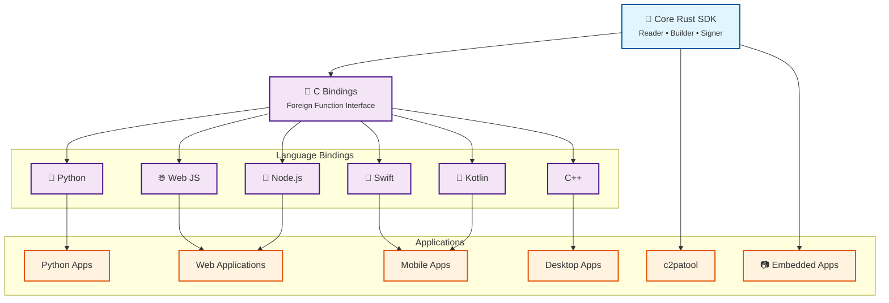

```mermaid
graph TB
    %% Core SDK Components
    SDK["🦀 Core Rust SDK<br/><small>Reader • Builder • Signer</small>"]

    %% C Bindings Layer
    CBindings["🔗 C Bindings<br/><small>Foreign Function Interface</small>"]

    %% Language Bindings
    subgraph "Language Bindings"
        CPP["C++"]
        Python["🐍 Python"]
        Swift["🍎 Swift"]
        Kotlin["📱 Kotlin"]
        NodeJS["📗 Node.js"]
        WebJS["🌐 Web JS"]
    end

    %% Applications
    subgraph "Applications"
        PythonApps["Python Apps"]
        WebApps["Web Applications"]
        MobileApps["Mobile Apps"]
        DesktopApps["Desktop Apps"]
        C2PATool["c2patool"]
        EmbeddedApps["📷 Embedded Apps"]
    end

    %% Connections
    SDK --> CBindings

    CBindings --> CPP
    CBindings --> Python
    CBindings --> Swift
    CBindings --> Kotlin
    CBindings --> NodeJS
    CBindings --> WebJS

    Python --> PythonApps
    WebJS --> WebApps
    NodeJS --> WebApps
    Swift --> MobileApps
    Kotlin --> MobileApps
    CPP --> DesktopApps
    
    %% Direct Rust SDK usage
    SDK --> C2PATool
    SDK --> EmbeddedApps

    %% Styling
    classDef coreSDK fill:#e1f5fe,stroke:#01579b,stroke-width:2px
    classDef bindings fill:#f3e5f5,stroke:#4a148c,stroke-width:2px
    classDef tools fill:#e8f5e8,stroke:#1b5e20,stroke-width:2px
    classDef apps fill:#fff3e0,stroke:#e65100,stroke-width:2px

    class SDK coreSDK
    class CBindings,CPP,Python,Swift,Kotlin,NodeJS,WebJS bindings
    class C2PATool,PythonApps,WebApps,MobileApps,DesktopApps,EmbeddedApps apps
```