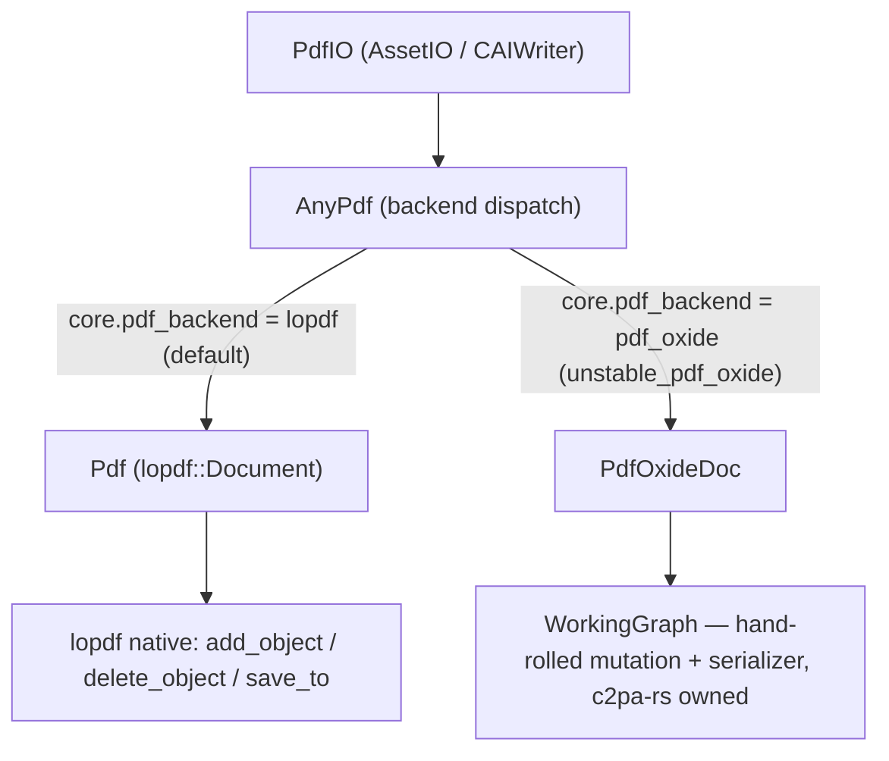
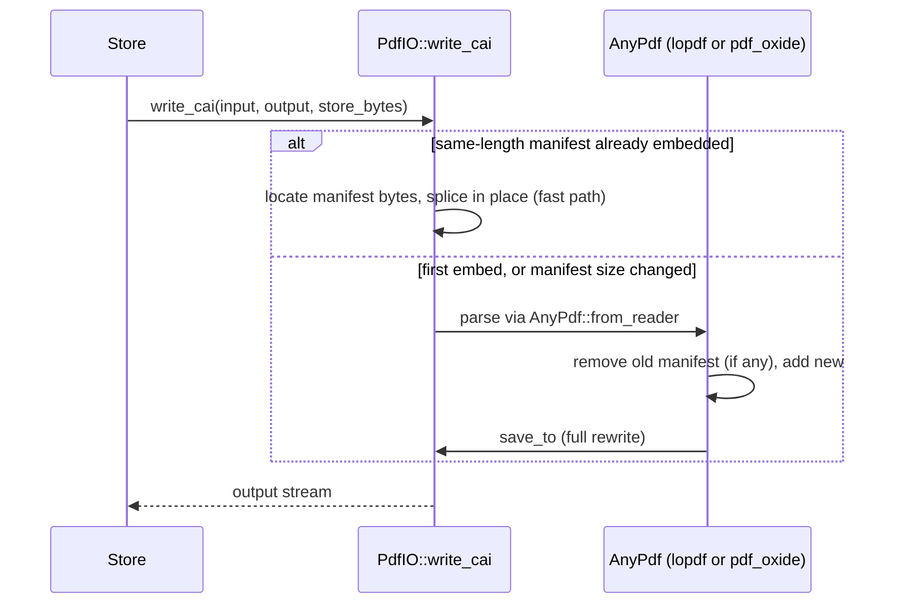

# `lopdf` vs `pdf_oxide`: engineering review

**Date:** 2026-09-08 · **Repo:** `c2pa-rs` (`unstable-pdf-oxide-backend`) · **Audience:** engineering review · **Status:** current — supersedes [`pdf-oxide-vs-lopdf-analysis.md`](pdf-oxide-vs-lopdf-analysis.md) and [`lopdf-vs-pdf-oxide-feature-comparison.md`](lopdf-vs-pdf-oxide-feature-comparison.md), both kept in place for history but not to be updated independently going forward.

**Contents**

- [Objective](#objective)
- [Glossary](#glossary)
- [Relevant Docs](#relevant-docs)
- [Assumptions](#assumptions)
- [Out of Scope](#out-of-scope)
- [High Level Breakdown](#high-level-breakdown)
  - [Capability Matrix](#capability-matrix)
  - [Limitations Comparison](#limitations-comparison)
  - [Diagrams](#diagrams)
- [APIs / Library Surfaces](#apis--library-surfaces)
  - [`lopdf` surface](#lopdf-surface)
  - [`pdf_oxide` surface](#pdf_oxide-surface)
- [General Purpose Considerations](#general-purpose-considerations)
  - [Test Coverage](#test-coverage)
  - [Performance & Scalability](#performance--scalability)
  - [Monitoring & Alerts](#monitoring--alerts)
  - [Legal & Privacy](#legal--privacy)
  - [Localization](#localization)
- [Risks](#risks)
- [Open Questions](#open-questions)
- [Sign Offs](#sign-offs)
- [References](#references)

## Objective

Decide which PDF library backend c2pa-rs should treat as the default, stable path for embedding and reading C2PA manifests in PDF assets: the existing `lopdf`-based backend, or the newer, experimental `pdf_oxide`-based backend. Both now implement the full read+write `C2paPdf` contract (embed as `EmbeddedFile` or `Annotation`, read, remove), so this review compares them on a like-for-like functional and non-functional basis and gives an engineering recommendation suitable for sign-off.

**Recommendation:** keep `lopdf` as the default, stable backend (`pdf` feature). Keep `pdf_oxide` experimental and opt-in (`unstable_pdf_oxide`, selected at runtime via `core.pdf_backend`), unpromoted for now. See [Risks](#risks) for the supporting reasoning.

## Glossary

| Term | Definition |
|---|---|
| `lopdf` | Rust crate providing a native, mutable PDF object-graph model (`Document`, `Object`, `Stream`) and its own serializer. c2pa-rs's current default PDF backend. |
| `pdf_oxide` | Newer Rust PDF crate, oriented around parsing/extraction (text, markdown, OCR). Proposed as a possible `lopdf` replacement; integrated in c2pa-rs as an experimental backend. |
| C2PA | Coalition for Content Provenance and Authenticity — the open standard that defines the manifest (Content Credentials) format this code embeds. |
| JUMBF | The binary box format the C2PA manifest store is serialized into before being embedded in an asset (here, a PDF). Referred to as `store_bytes` in the code. |
| `AFRelationship` | The PDF key that marks an Associated File's role. C2PA requires the value `C2PA_Manifest`. |
| `EmbeddedFile` / `Filespec` | The PDF constructs used to attach the manifest bytes as an associated file. |
| Incremental update | A PDF write mode that preserves the original file's bytes and appends a new revision, rather than re-serializing the whole document. Not currently used by c2pa-rs's write path on either backend. |
| xref | The PDF cross-reference table mapping object numbers to byte offsets; required in every serialized PDF. |
| `AssetIO` / `CAIWriter` | c2pa-rs's internal traits that every asset-format backend (PDF, JPEG, PNG, …) implements to support manifest read/write. |
| `AnyPdf` | The enum in `pdf.rs` that dispatches between the `lopdf`-backed `Pdf` and the `pdf_oxide`-backed `PdfOxideDoc` based on the `core.pdf_backend` setting. |
| `WorkingGraph` | The hand-rolled, c2pa-rs-owned mutable object graph and serializer built on top of `pdf_oxide`, because `pdf_oxide` itself has no document-mutation API. |
| Hard binding | The C2PA mechanism that cryptographically ties the manifest to the specific bytes of the asset via a content hash, so the exclusion range (where the manifest itself sits) must be tracked precisely. |

## Relevant Docs

- Superseded: [`pdf-oxide-vs-lopdf-analysis.md`](pdf-oxide-vs-lopdf-analysis.md) (2026-08-31, pre-write-path), [`lopdf-vs-pdf-oxide-feature-comparison.md`](lopdf-vs-pdf-oxide-feature-comparison.md) (2026-09-08)
- [`docs/experimental-features.md`](experimental-features.md) — the policy `unstable_pdf_oxide` is gated under
- Source: [`sdk/src/asset_handlers/pdf.rs`](../sdk/src/asset_handlers/pdf.rs), [`sdk/src/asset_handlers/pdf_oxide.rs`](../sdk/src/asset_handlers/pdf_oxide.rs), [`sdk/src/asset_handlers/pdf_io.rs`](../sdk/src/asset_handlers/pdf_io.rs), [`sdk/Cargo.toml`](../sdk/Cargo.toml)
- Upstream: [`lopdf` on crates.io](https://crates.io/crates/lopdf), [`pdf_oxide` on crates.io](https://crates.io/crates/pdf_oxide)
- C2PA spec: PDF embedding section (`/c2pa-spec-lookup lookup "embedding manifests into pdfs"` if a fresh cross-check is needed)

## Assumptions

- Binary-size and dependency-tree figures were measured 2026-08-31 on macOS arm64, `cargo build --release`, default profiles (no fat LTO), stripped via `strip -x`, on a read-only workload. The write path added no new dependencies to either backend, so the ratios should still hold for a write-capable binary; not re-measured for this review.
- Scope is PDF manifest embedding/reading as c2pa-rs uses it today — not general-purpose PDF authoring, rendering, or text extraction.
- c2pa-rs rejects password-protected PDFs for writing on **both** backends already, so encrypted-PDF write fidelity is not a live decision factor here.
- `core.pdf_backend` is a runtime setting, not a compile-time fork — both backends already build and pass their (mirrored) test suites under `unstable_pdf_oxide`.

## Out of Scope

- Native PDF digital signatures (`/Sig`, PKCS#7/PAdES/RFC-3161) — orthogonal to C2PA provenance, which doesn't use them.
- Rendering, text extraction, redaction, font subsetting — present in `pdf_oxide` proper, unused by c2pa-rs's integration.
- Adopting incremental (byte-preserving) update signing — only relevant if that becomes a hard requirement; a `lopdf`-only path today (`IncrementalDocument`).
- WASM build/runtime verification of the `pdf_oxide` backend.
- An independent fuzzing/security audit of either PDF parser (called out under [Risks](#risks), not resolved here).

## High Level Breakdown

### Capability Matrix

| Capability | `lopdf` backend | `pdf_oxide` backend | Notes |
|---|:---:|:---:|---|
| Read: detect embedded C2PA manifest (`/AF` + `AFRelationship=C2PA_Manifest`) | ✅ | ✅ | Same logic, reimplemented per backend's object model |
| Read: manifest stored as `EmbeddedFile` | ✅ | ✅ | |
| Read: manifest stored as page `Annotation` (`FileAttachment`) | ✅ | ✅ | |
| Read: XMP metadata | ✅ (`Document.catalog → Metadata` stream) | ✅ (`pdf_oxide::extractors::xmp::XmpExtractor`) | |
| Read: detect password-protection | ✅ (`Document::is_encrypted`) | ✅ (`PdfDocument::is_encrypted`) | Detect-and-reject in c2pa-rs on both backends |
| Read: malformed/broken xref recovery | ❌ (hard error if trailer/xref won't parse; no scan-and-rebuild salvage) | ✅ (`xref_reconstruction.rs`) | Real advantage for `pdf_oxide` on damaged real-world PDFs |
| Write: embed manifest as `EmbeddedFile` | ✅ (native `add_object` + dict mutation) | ✅ (hand-rolled `WorkingGraph`) | `pdf_oxide`'s typed `EmbeddedFile` builder can't emit `AFRelationship = C2PA_Manifest` (fixed enum, no custom variant) — both backends hand-author the Filespec dict via the raw object model |
| Write: embed manifest as page `Annotation` | ✅ | ✅ (hand-rolled) | |
| Write: remove manifest | ✅ | ✅ | |
| Write: same-length in-place patch (byte-offset stable) | ✅ — format-agnostic raw byte splice in `pdf_io.rs` | ✅ — same code path, backend-independent | Used whenever a same-length manifest is already embedded (the normal signing flow) |
| Write: full-document rewrite mechanism | `Document::save_to` — `lopdf`'s own writer | Fully hand-rolled in c2pa-rs (`WorkingGraph::serialize_to`) | See [APIs / Library Surfaces](#apis--library-surfaces) |
| Write: incremental (byte-preserving) update | Not wired up, but `lopdf::IncrementalDocument` exists | Not available; no analog | Neither used today |
| Write: modern xref / object streams | Supported (`save_modern`), unused today | Always classic xref; no object-stream writing | Neither exercised today |
| Native PDF digital signatures | ❌ | Present (`pdf_oxide::signatures`), unused | Orthogonal to C2PA |
| Rendering / extraction / redaction | ❌ | Present, unused | Out of current scope |

### Limitations Comparison

Where the Capability Matrix asks "does it do X", this table asks "where does each backend actually fall short, and does the other one share the same gap or not."

| Limitation | `lopdf` | `pdf_oxide` | Notes |
|---|---|---|---|
| No document-mutation API for writing | Not a limitation — mutation is native (`add_object`/`delete_object`/`catalog_mut`) | **Yes** — public API has no "add/mutate an object" primitive at all; c2pa-rs hand-rolls its own mutable graph (`WorkingGraph`) and serializer on top | |
| No malformed/broken-xref recovery | **Yes** — hard error if trailer/xref won't parse; no scan-and-rebuild salvage path | Not a limitation — has `xref_reconstruction.rs` | |
| No byte-preserving (incremental) update support | Partial — not wired up in c2pa-rs's write path today, but the library ships `IncrementalDocument` as a ready-made path to it | **Yes** — no incremental-update mechanism exists at all; would have to be built from scratch on top of already-hand-rolled code | |
| Full rewrite invalidates any pre-existing PDF digital signature | **Yes** — `Document::save_to` always fully re-serializes | **Yes** — `WorkingGraph::serialize_to` is likewise always a full rewrite | Shared limitation — neither preserves prior signatures today |
| No typed, C2PA-usable embedded-file/annotation builder | **Yes** — no typed builder exists at all; everything is hand-authored via the raw object model | **Yes** — typed builders exist (`EmbeddedFile`, `FileAttachmentAnnotation`) but can't emit `AFRelationship = C2PA_Manifest` (fixed enum, no custom variant), so they're unusable here too | Shared limitation, for different reasons — both end up at the same raw-object-model effort |
| No native PDF digital signature support (`/Sig`) | **Yes** — not present | Not a limitation — present (`pdf_oxide::signatures`), though orthogonal to C2PA and unused by c2pa-rs | |
| No rendering / text extraction / redaction / font subsetting | **Yes** — not `lopdf`'s purpose | Not a limitation — present, unused by c2pa-rs's integration | |
| Whole-file, in-memory, non-streaming | **Yes** — `load_mem` parses the entire document; memory scales with file size | **Yes** — same class of parser; no streaming mode surfaced to c2pa-rs either | Shared limitation |
| Limited encrypted-PDF write/round-trip fidelity | **Yes** — can decrypt with a password for reading, but writing/round-tripping encrypted PDFs is limited | Unknown — decryption/round-trip depth not independently verified in this review | Moot in practice: c2pa-rs rejects password-protected PDFs for writing on both backends |
| No independent fuzzing / security audit by c2pa-rs | **Yes** — ships its own guards (decompression-bomb cap, `ReferenceLimit`) but not independently fuzzed by c2pa-rs | **Yes** — ships its own xref-reconstruction/parsing hardening, not itemized or independently audited by c2pa-rs | Shared gap |
| Footprint cost | Not a limitation — smaller baseline | **Yes** — ~2.9× stripped release binary size, ~2.7× dependency tree | See [Performance & Scalability](#performance--scalability) |
| WASM / `no_std` maturity | Not a limitation — works under c2pa-rs's existing rayon carve-out | **Yes** — no `no_std`; `libc`/`env_logger` always-on; WASM behind a feature, unverified against c2pa-rs's build matrix | |

### Diagrams

**Backend dispatch:**



**Write flow (`write_cai`), same for both backends:**



The fast path matters because `Store` embeds a placeholder-signed manifest, computes a data hash over the asset, then re-embeds the final signed manifest of identical length — any byte shift at that point would invalidate the hash. The slow path is where the two backends' implementations diverge in ownership (see below).

## APIs / Library Surfaces

### `lopdf` surface

Native document mutation and serialization, owned by the library:

```rust
// Add the manifest as an indirect stream + Filespec object.
let stream_ref = document.add_object(Stream::new(dict, manifest_bytes));
let filespec_ref = document.add_object(dictionary! {
    "AFRelationship" => Name("C2PA_Manifest".into()),
    "EF" => dictionary! { "F" => Reference(stream_ref) },
    // ...
});
document.catalog_mut()?.set("AF", vec![Reference(filespec_ref)]);

// lopdf's own writer: object numbering, xref, trailer.
document.save_to(&mut writer)?;
```

### `pdf_oxide` surface

`pdf_oxide` has no "add an object to this document" primitive, so c2pa-rs owns the mutation and serialization itself (`WorkingGraph`, `pdf_oxide.rs:216-625`):

```rust
// c2pa-rs-owned mutable graph — pdf_oxide has no equivalent.
let stream_ref = working_graph.allocate_id();
working_graph.objects.insert(stream_ref, Object::Stream { dict, data: manifest_bytes.into() });
let filespec_ref = working_graph.allocate_id();
working_graph.objects.insert(filespec_ref, Object::Dictionary(filespec_dict));
working_graph.push_associated_file(filespec_ref);

// c2pa-rs-owned serializer: hand-written header, per-object
// pdf_oxide::writer::ObjectSerializer::serialize_indirect calls, and a
// hand-written classic (ISO 32000-1 §7.5.4) xref table + trailer.
working_graph.serialize_to(&mut writer)?;
```

`pdf_oxide` supplies only `PdfDocument::load_object` (read) and `ObjectSerializer::serialize_indirect` (per-object write) as primitives; the graph walk, mutation, and xref/trailer generation are all in-tree.

## General Purpose Considerations

### Test Coverage

Both backends are covered by a mirrored unit-test suite — 20 tests in `pdf.rs`, 19 in `pdf_oxide.rs` — exercising embed-as-file, embed-as-annotation, remove, XMP, password-detection, and round-trip save/reload, all currently green. The write path is additionally validated end-to-end via `Builder::sign` → embed → `Reader` verify, confirming `assertion.dataHash.match` and `claimSignature.validated` on the `lopdf` backend. The `pdf_oxide` backend's own `test_save_to` cross-checks its hand-rolled serializer output by re-parsing with `lopdf` as an independent second parser — a good signal, but one fixture, not a corpus (see [Risks](#risks)).

### Performance & Scalability

| Attribute | `lopdf` | `pdf_oxide` |
|---|---|---|
| Release binary size, stripped (minimal parse app) | 0.89 MB | 2.59 MB (**~2.9×**) |
| Marginal footprint over empty baseline | +0.53 MB | +2.23 MB (**~4.2×**) |
| Dependency tree | 52 crates | 141 crates (**~2.7×**) |
| Always-on dependencies | 18 total, trimmed via `default-features = false` | ~39 non-optional even at lean defaults: `image`, `jpeg-decoder`, `taffy`, `subsetter`, `ttf-parser`, `regex`, `chrono`, `env_logger`, `libc`, … |
| Memory model | Whole-file, in-memory object graph; scales with file size | Same class; no streaming mode surfaced to c2pa-rs either |
| WASM / `no_std` fit | Works under c2pa-rs's existing rayon carve-out | No `no_std`; `libc`/`env_logger` always-on; WASM behind a feature, unverified against c2pa-rs's build matrix |

### Monitoring & Alerts

N/A — this is a library/dependency choice with no runtime telemetry or alerting surface of its own. (The only related signal is upstream crate health: `lopdf` is established since 2016; `pdf_oxide` is young, 0.3.x since 2025, with the usual pre-1.0 change risk that implies.)

### Legal & Privacy

| Attribute | `lopdf` | `pdf_oxide` |
|---|---|---|
| License | MIT | MIT OR Apache-2.0 |
| MSRV | 1.88 | 1.88 |
| Supply-chain / audit surface | Smaller (52 crates) | Larger (141 crates, ~2.7×) — more transitive licenses and CVEs to track |

Both licenses are compatible with c2pa-rs's existing terms; no legal blocker either way. The larger dependency tree under `pdf_oxide` is a larger ongoing audit surface, not a licensing problem per se.

### Localization

N/A — no user-facing strings involved in this library choice.

## Risks

1. **Write-path ownership sits in the wrong place for `pdf_oxide`.** Its public API has no document-mutation primitive (stated directly in `pdf_oxide.rs`'s module doc), so the entire write path — object-graph mutation *and* PDF serialization, including hand-writing a cross-reference table — is c2pa-rs-owned code with no upstream test suite or user base behind it. A subtle PDF-serialization bug there is c2pa-rs's to find, not a library maintainer's.
2. **Quantified footprint cost.** ~2.9× stripped release binary size and ~2.7× dependency tree for zero functional gain in this workload, on a security-critical, WASM-targeting, size-conscious SDK.
3. **Round-trip fidelity is lightly tested.** `pdf_oxide` backend's cross-check against `lopdf` covers one fixture; a broader corpus (varied real-world PDFs, object streams, encrypted documents) would be needed before trusting the hand-rolled serializer on the provenance hard-binding path at scale.
4. **Neither parser has been independently fuzzed** by c2pa-rs. This is a pre-existing gap on both backends, not specific to this decision, but worth tracking regardless of outcome.
5. **Process gap:** `unstable_pdf_oxide` is not yet listed in `experimental-features.md`'s registry table, which the project's own policy requires.

None of these risks are blocking for keeping the status quo (`lopdf` default, `pdf_oxide` experimental); (1)–(3) are the reasons *against* promoting `pdf_oxide` today.

## Open Questions

| Question | From | Answer | By | On |
|---|---|---|---|---|
| Should `unstable_pdf_oxide` be added to `experimental-features.md`'s registry now? | This review | | | |
| Should `lopdf`'s `IncrementalDocument` be adopted if byte-preserving incremental signing becomes a requirement? | This review | | | |
| Is a broader round-trip fidelity corpus needed before `pdf_oxide` could ever be promoted? | This review | | | |
| Is there a CAI Jira ticket this review should be linked to? | This review | None supplied in this session | | |

## Sign Offs

| Team | Who | Date |
|---|---|---|
| SDK (PDF backend owners) | | |
| Security | | |

## References

1. [`pdf-oxide-vs-lopdf-analysis.md`](pdf-oxide-vs-lopdf-analysis.md) — original narrative analysis (2026-08-31)
2. [`lopdf-vs-pdf-oxide-feature-comparison.md`](lopdf-vs-pdf-oxide-feature-comparison.md) — prior tabular comparison (2026-09-08)
3. [`docs/experimental-features.md`](experimental-features.md)
4. [`sdk/src/asset_handlers/pdf.rs`](../sdk/src/asset_handlers/pdf.rs), [`pdf_oxide.rs`](../sdk/src/asset_handlers/pdf_oxide.rs), [`pdf_io.rs`](../sdk/src/asset_handlers/pdf_io.rs)
5. [`sdk/Cargo.toml`](../sdk/Cargo.toml)
6. [`lopdf` on crates.io](https://crates.io/crates/lopdf)
7. [`pdf_oxide` on crates.io](https://crates.io/crates/pdf_oxide)
