# C2PA Rust SDK Architecture Overview

This document provides a comprehensive overview of the core SDK architecture in the `c2pa-rs` project. The SDK implements the [C2PA technical specification](https://c2pa.org/specifications/specifications/2.2/specs/C2PA_Specification.html) and enables applications to create, sign, embed, and validate C2PA manifests in various asset types.

## Table of Contents

- [Overview](#overview)
- [Core Architecture](#core-architecture)
- [Major Components](#major-components)
  - [Public API Layer](#public-api-layer)
  - [Manifest Store & Claims](#manifest-store--claims)
  - [Assertions](#assertions)
  - [Ingredients](#ingredients)
  - [Cryptography & Signing](#cryptography--signing)
  - [Asset Handlers](#asset-handlers)
  - [JUMBF Structure](#jumbf-structure)
  - [Identity & Validation](#identity--validation)
  - [Resource Management](#resource-management)
- [Data Flow](#data-flow)
- [Key Design Patterns](#key-design-patterns)

## Overview

The C2PA Rust SDK provides a comprehensive implementation for working with Content Credentials (C2PA manifests). It supports:

- **Reading**: Parse and validate C2PA manifests from signed assets
- **Writing**: Create and sign new C2PA manifests
- **Validation**: Verify cryptographic signatures and trust chains
- **Multiple formats**: JPEG, PNG, TIFF, GIF, MP3, MP4, PDF, SVG, and more
- **Identity assertions**: Support for CAWG identity specifications
- **Async/sync APIs**: Full support for both synchronous and asynchronous operations

## Core Architecture

The SDK follows a layered architecture design:

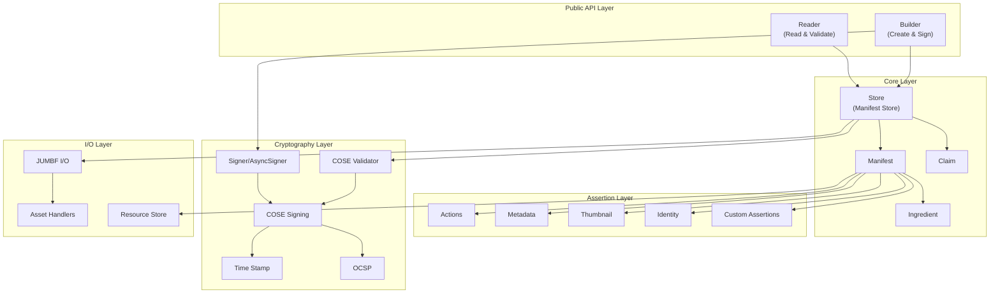

## Major Components

### Public API Layer

The SDK provides two primary entry points for users:

#### Builder

The **Builder** is used to create and sign C2PA manifests. It provides a fluent API for:
- Defining manifest structure via JSON or programmatic API
- Adding assertions (standard and custom)
- Adding ingredients from existing assets
- Signing manifests with various cryptographic algorithms
- Embedding manifests into assets

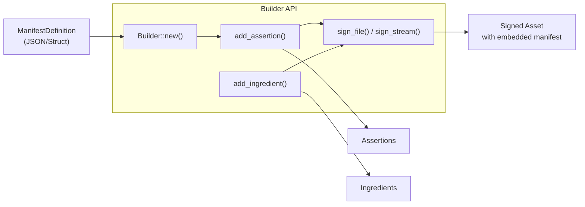

**Key files:**
- `sdk/src/builder.rs` - Main builder implementation
- `sdk/src/lib.rs` - Public exports

#### Reader

The **Reader** validates and extracts C2PA manifests from assets:
- Reads manifests from file streams
- Validates cryptographic signatures
- Checks trust chains
- Provides validation reports
- Extracts manifest data as JSON or structured objects

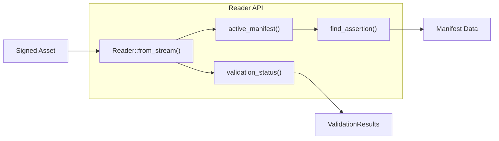

**Key files:**
- `sdk/src/reader.rs` - Main reader implementation
- `sdk/src/validation_results.rs` - Validation reporting

### Manifest Store & Claims

The **Store** is the central internal component managing the collection of manifests in an asset.

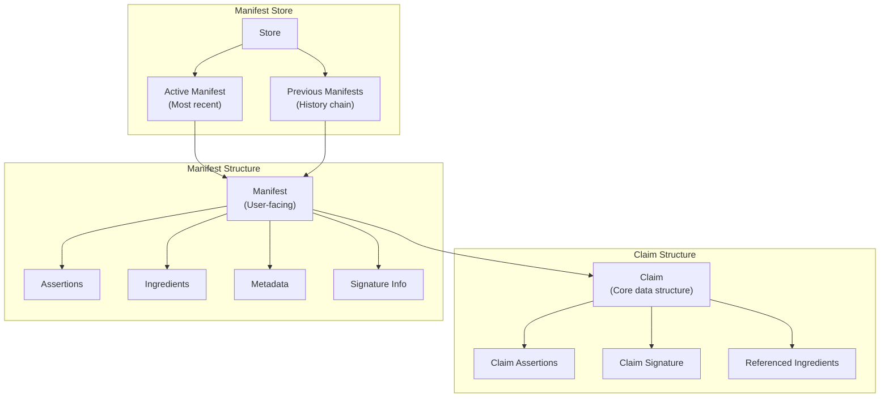

**Key concepts:**
- **Store**: Container for all manifests in an asset (active + historical)
- **Claim**: Internal representation of signed data (JUMBF structure)
- **Manifest**: User-facing representation of claim data
- **Provenance chain**: Linked history of all edits/modifications

**Key files:**
- `sdk/src/store.rs` - Manifest store implementation (~8500 lines)
- `sdk/src/claim.rs` - Claim structure and operations (~4000 lines)
- `sdk/src/manifest.rs` - Manifest API (~1900 lines)

### Assertions

Assertions are pieces of metadata that describe the asset. The SDK supports both standard C2PA assertions and custom assertions.

```mermaid
graph TB
    subgraph "Standard C2PA Assertions"
        Actions["Actions<br/>(c2pa.actions)"]
        CreativeWork["Creative Work<br/>(stds.schema-org.CreativeWork)"]
        DataHash["Data Hash<br/>(c2pa.hash.data)"]
        Thumbnail["Thumbnail<br/>(c2pa.thumbnail)"]
        BmffHash["BMFF Hash<br/>(c2pa.hash.bmff)"]
        BoxHash["Box Hash<br/>(c2pa.hash.boxes)"]
    end
    
    subgraph "Metadata Assertions"
        EXIF["EXIF<br/>(stds.exif)"]
        Metadata["Asset Metadata<br/>(c2pa.assertions.metadata)"]
        SchemaOrg["Schema.org<br/>(schema.org)"]
    end
    
    subgraph "Advanced Assertions"
        Identity["Identity<br/>(cawg.identity)"]
        SoftBinding["Soft Binding<br/>(c2pa.soft-binding)"]
        EmbeddedData["Embedded Data"]
    end
    
    subgraph "Custom Assertions"
        UserCBOR["User CBOR<br/>(custom labels)"]
        UserJSON["User JSON<br/>(custom labels)"]
    end
    
    AssertionBase["Assertion Base Trait"]
    
    Actions --> AssertionBase
    CreativeWork --> AssertionBase
    DataHash --> AssertionBase
    Thumbnail --> AssertionBase
    BmffHash --> AssertionBase
    BoxHash --> AssertionBase
    EXIF --> AssertionBase
    Metadata --> AssertionBase
    SchemaOrg --> AssertionBase
    Identity --> AssertionBase
    SoftBinding --> AssertionBase
    EmbeddedData --> AssertionBase
    UserCBOR --> AssertionBase
    UserJSON --> AssertionBase
```

**Key assertion types:**

1. **Actions** (`c2pa.actions`): Documents what was done to the asset
   - Examples: edited, cropped, filtered, color_adjusted
   - Includes parameters and software information

2. **Hashes** (`c2pa.hash.*`): Cryptographic hashes for validation
   - Data hash: Hash of the asset binary data
   - BMFF hash: Hash for video containers (MP4, etc.)
   - Box hash: Hash of specific boxes/chunks

3. **Metadata** (`c2pa.assertions.metadata`): Human and machine-readable metadata
   - Title, description, author
   - Location, creation date
   - Rights and licensing

4. **Thumbnail** (`c2pa.thumbnail`): Visual representation of asset state

5. **Identity** (`cawg.identity`): CAWG identity assertion for advanced identity verification

**Key files:**
- `sdk/src/assertions/` - All assertion implementations (23 files)
- `sdk/src/assertion.rs` - Base assertion trait and logic

### Ingredients

Ingredients represent external assets used in creating the current asset. They preserve provenance chains.

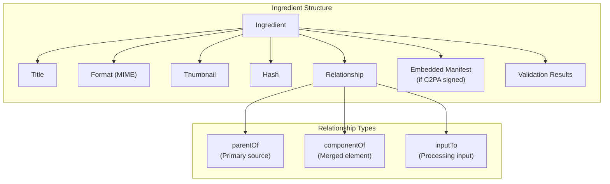

**Key features:**
- Preserves full C2PA manifests from source assets
- Maintains provenance chain across multiple edits
- Supports various relationship types (parent, component, input)
- Automatic thumbnail extraction when available
- Validation of ingredient manifests

**Key files:**
- `sdk/src/ingredient.rs` - Ingredient implementation (~2100 lines)

### Cryptography & Signing

The cryptography layer handles all signing and validation operations.

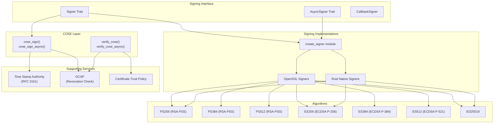

**Key components:**

1. **Signer trait**: Interface for cryptographic signing
   - Supports sync and async variants
   - Pluggable signature implementations
   - Built-in support for time stamping and OCSP

2. **COSE (CBOR Object Signing and Encryption)**: C2PA's signature format
   - Standard defined in RFC 8152
   - Supports multiple algorithms
   - Includes certificate chains

3. **Time Stamping**: RFC 3161 trusted time stamps
   - Proves when signing occurred
   - Protects against backdating

4. **OCSP (Online Certificate Status Protocol)**: Certificate revocation checking
   - Real-time validation of certificate status
   - Can be embedded in signature

5. **Trust policies**: Configurable trust validation
   - Custom trust anchors
   - Certificate chain validation
   - Extended Key Usage (EKU) verification

**Key files:**
- `sdk/src/signer.rs` - Signer traits
- `sdk/src/create_signer.rs` - Signer factory functions
- `sdk/src/cose_sign.rs` - COSE signing implementation
- `sdk/src/cose_validator.rs` - COSE validation
- `sdk/src/crypto/` - Cryptography primitives (66 files)
  - `sdk/src/crypto/cose/` - COSE implementation
  - `sdk/src/crypto/raw_signature/` - Signing algorithms
  - `sdk/src/crypto/time_stamp/` - Time stamping
  - `sdk/src/crypto/ocsp/` - OCSP support

### Asset Handlers

Asset handlers provide format-specific I/O operations for different file types.

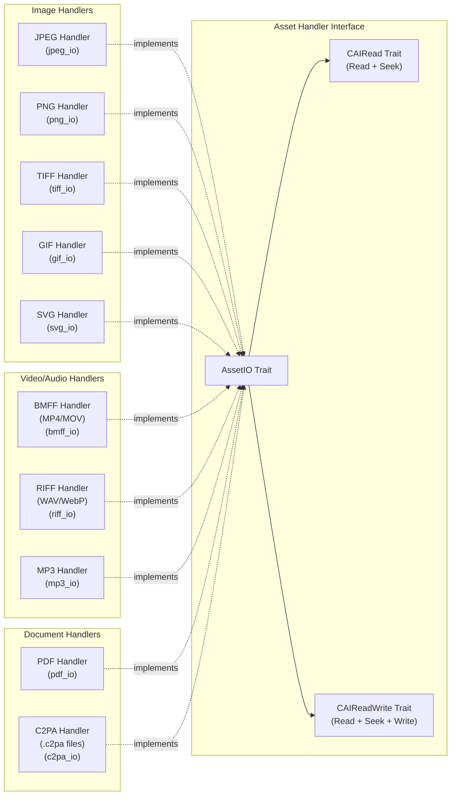

**Handler responsibilities:**
- Locate C2PA data within format-specific structures
- Extract C2PA manifests from assets
- Embed C2PA manifests into assets
- Handle format-specific quirks and constraints
- Preserve existing metadata when possible

**Key operations:**
- `read_cai()`: Extract C2PA manifest store
- `save_cai_store()`: Embed manifest store
- `remote_ref_writer_ref()`: Handle external manifests
- `supported_types()`: Report MIME types supported

**Key files:**
- `sdk/src/asset_handlers/` - All format handlers (12 files)
- `sdk/src/asset_io.rs` - Common I/O traits

### JUMBF Structure

JUMBF (JPEG Universal Metadata Box Format) is the container format for C2PA data. It's based on ISO BMFF (Base Media File Format).

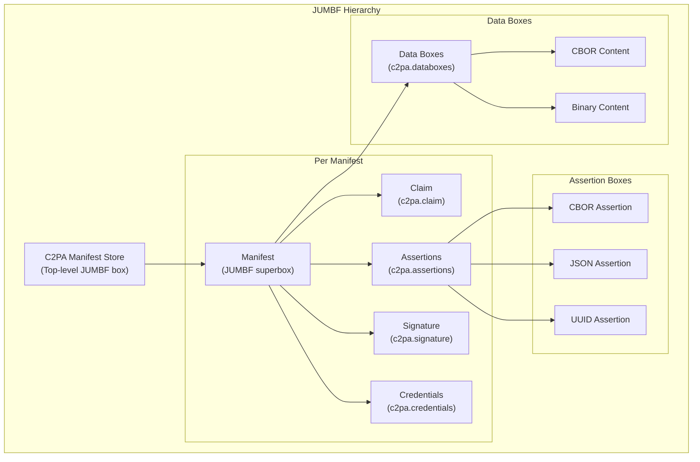

**JUMBF box types:**
- **Superbox**: Container for other boxes (like a directory)
- **CBOR box**: Contains CBOR-encoded data
- **JSON box**: Contains JSON-encoded data
- **UUID box**: Contains binary data identified by UUID
- **Embedded file**: Contains embedded binary assets

**Label structure:**
- Uses URN-style identifiers: `urn:c2pa:manifest:label`
- Hierarchical organization: `manifest/assertion/sub-assertion`
- Standard labels defined by C2PA specification
- Custom labels use reverse-domain notation

**Key files:**
- `sdk/src/jumbf/` - JUMBF implementation (4 files)
  - `boxes.rs` - Box structure definitions
  - `boxio.rs` - Box I/O operations
  - `labels.rs` - Label utilities
- `sdk/src/jumbf_io.rs` - High-level JUMBF I/O

### Identity & Validation

The identity module implements the CAWG (Coalition for Authenticity and Governance) identity assertion specification.

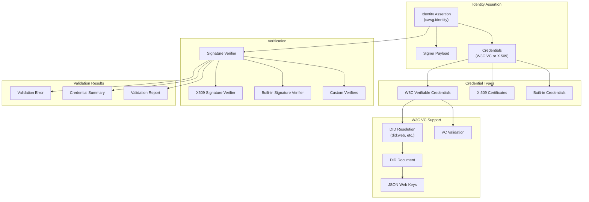

**Key features:**

1. **Identity Assertion Builder**: Create identity assertions with credentials
2. **Multiple credential types**: X.509 certificates, W3C Verifiable Credentials, built-in credentials
3. **DID support**: Resolution of Decentralized Identifiers (DID)
4. **Signature verification**: Pluggable verification system
5. **Claim aggregation**: Support for multi-credential validation

**Validation states:**
- **Invalid**: Fails structural or cryptographic requirements
- **Valid**: Well-formed and cryptographically sound
- **Trusted**: Valid and signed by trusted authority

**Key files:**
- `sdk/src/identity/` - Identity implementation (80 files)
  - `builder/` - Identity assertion creation
  - `identity_assertion/` - Core assertion structure
  - `x509/` - X.509 credential support
  - `claim_aggregation/` - W3C VC support
  - `validator.rs` - Validation logic

### Resource Management

The resource store manages binary resources (thumbnails, embedded data, etc.) referenced by manifests.

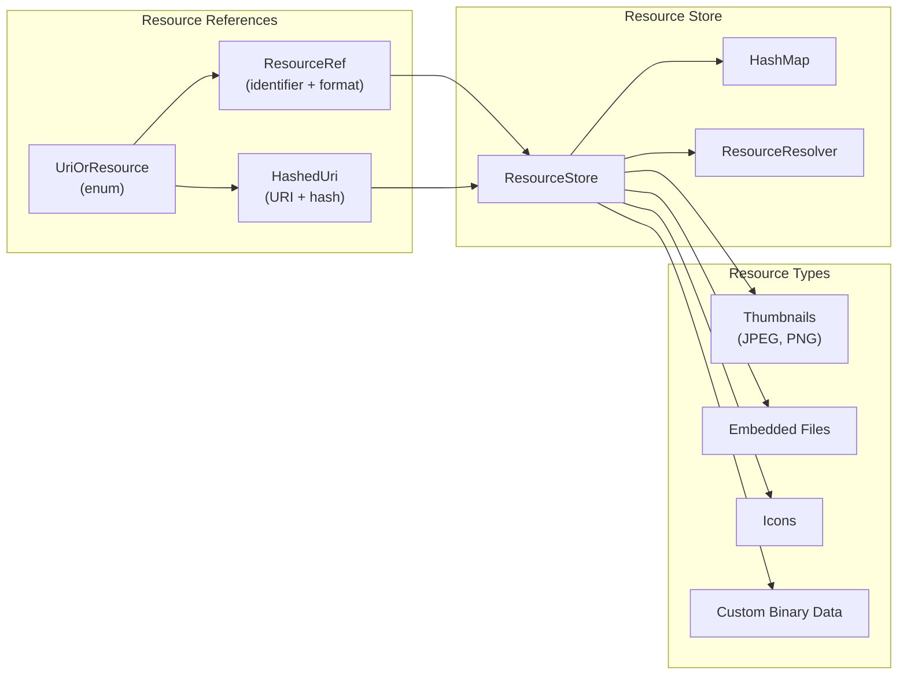

**Key concepts:**
- **ResourceRef**: Local reference before signing (identifier-based)
- **HashedUri**: Final reference after signing (URI + hash)
- **UriOrResource**: Union type that can be either
- **ResourceResolver**: Custom resolution logic for external resources

**Key files:**
- `sdk/src/resource_store.rs` - Resource management (~500 lines)

## Data Flow

### Creating a Signed Manifest

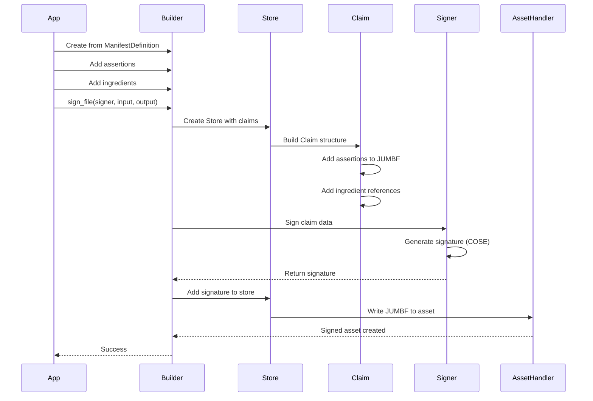

### Reading and Validating a Manifest

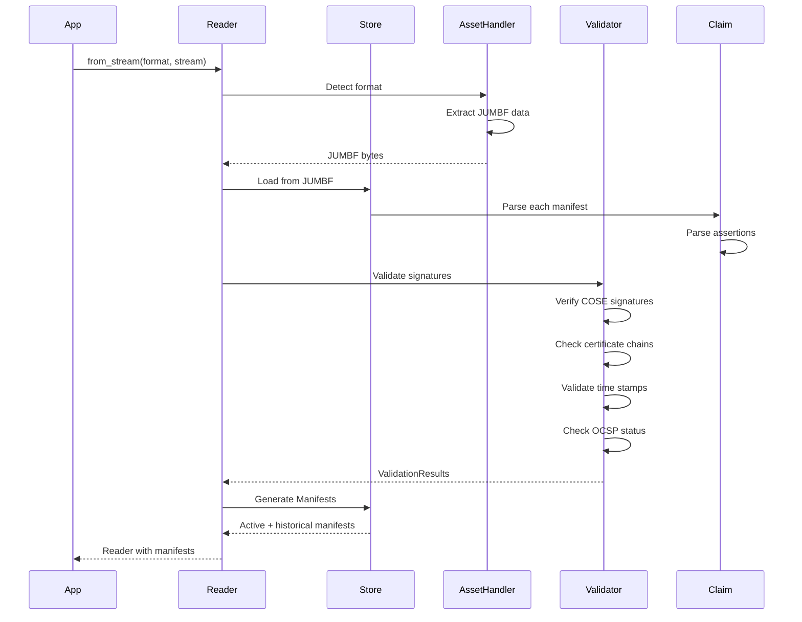

### Ingredient Processing

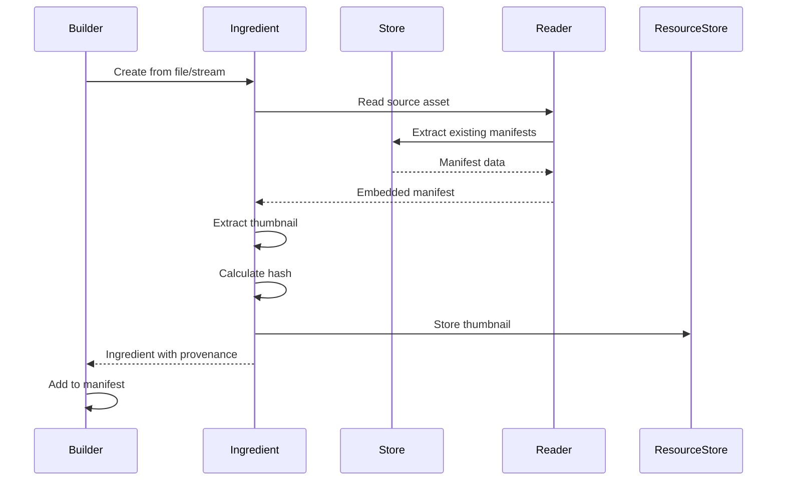

## Key Design Patterns

### 1. Async/Sync Duality

The SDK supports both synchronous and asynchronous operations through the `async_generic` macro:

```rust
#[async_generic]
pub fn from_stream(format: &str, stream: impl Read + Seek) -> Result<Reader> {
    // Implementation works for both sync and async
}
```

This generates both `from_stream()` and `from_stream_async()` from a single implementation.

### 2. Trait-Based Extensibility

Key extension points use traits:
- **Signer/AsyncSigner**: Custom signing implementations
- **AssetIO**: New file format support
- **AssertionBase**: Custom assertion types
- **PostValidator**: Custom validation logic

### 3. Stream-Based Processing

The SDK emphasizes stream-based I/O:
- Reduces memory footprint
- Supports large files
- Enables progressive processing
- Works with any `Read + Seek` source

### 4. Builder Pattern

The Builder API uses the builder pattern extensively:
- Fluent method chaining
- Progressive construction
- Validation before signing
- Clear separation of concerns

### 5. Error Handling

Comprehensive error handling using Result types:
- Rich error types with context
- Error propagation with `?` operator
- Validation errors vs. structural errors
- Detailed error messages

### 6. Feature Flags

Conditional compilation for different use cases:
- `openssl` vs `rust_native_crypto`
- `file_io` for filesystem operations
- `json_schema` for schema generation
- `pdf` for PDF support
- `fetch_remote_manifests` for network operations

### 7. Resource Management

Explicit resource management:
- ResourceStore for binary assets
- Automatic cleanup of temporary files
- Stream closing and error recovery
- Memory-efficient data structures

## Conclusion

The C2PA Rust SDK is a comprehensive, production-ready implementation of the C2PA specification. Its layered architecture provides:

- **Flexibility**: Support for multiple formats, algorithms, and use cases
- **Extensibility**: Trait-based design for custom implementations
- **Performance**: Stream-based processing and efficient data structures
- **Reliability**: Comprehensive validation and error handling
- **Standards compliance**: Full implementation of C2PA and CAWG specifications

The SDK is suitable for a wide range of applications, from command-line tools to server applications to embedded systems, with support for both synchronous and asynchronous execution models.

