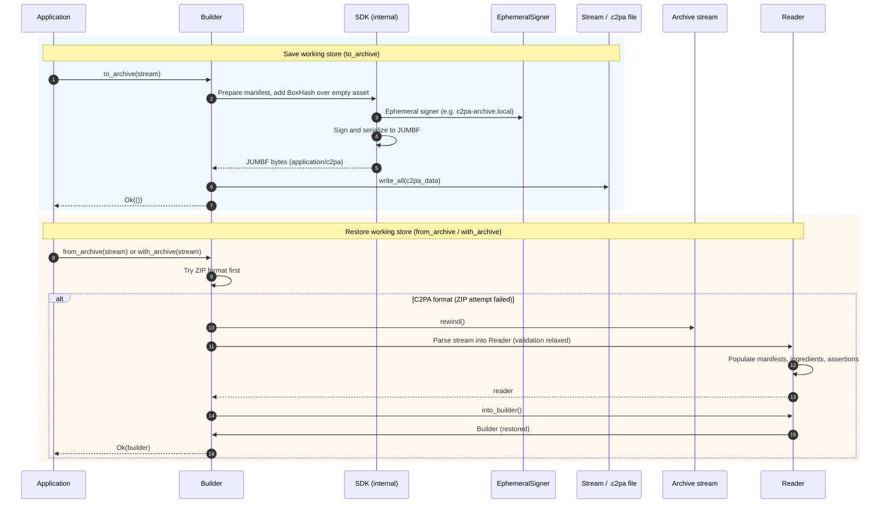

# Working stores and C2PA archives

This document explains how **working stores** and **C2PA archives** work in the C2PA SDK, how they relate to each other, and how to save and restore builder state.

## Working stores vs C2PA archives

**Working store** and **C2PA archive** refer to the same underlying concept; the difference is one of emphasis:

| Term | Emphasis |
|------|----------|
| **Working store** | The *content*: an editable C2PA manifest state (claims, ingredients, assertions) that has not yet been bound to a final asset. Often used when describing the in-memory or serialized form of “work in progress” manifest data. |
| **C2PA archive** | The *artifact*: the saved bytes (e.g. in a `.c2pa` file or stream) that you get from saving a working store and read back to restore a `Builder`. |

Both use the **same on-disk/wire format**: standard JUMBF `application/c2pa`. That is, a C2PA archive *is* a working store serialized as a normal C2PA manifest store. The spec does not define a separate “archive” format; the SDK reuses the standard manifest store format so that:

- The same format is used for **signed manifests** (bound to an asset), **working stores** (saved for later editing), and **saved ingredients** (e.g. validated once, reused in other manifests).
- Archives can be embedded in files, stored in the cloud, or saved as sidecar `.c2pa` files.

**Distinction in practice:**

- When you **save** a `Builder` with `to_archive()`, you produce a **working store** (serialized as JUMBF `application/c2pa`). That serialized form is what we call a **C2PA archive**.
- When you **restore** with `from_archive()` or `with_archive()`, you read that **C2PA archive** back into a `Builder` — i.e. you restore the **working store** so you can continue editing.

So: one concept, two names. “Working store” stresses the editable state; “C2PA archive” stresses the saved, portable representation.

### Legacy ZIP archive format

The SDK also supports an older archive format: a **ZIP** file containing `manifest.json`, `resources/`, and `manifests/`. (See [Settings](./settings.md) for more information on settings.) This format is generated when the setting `builder.generate_c2pa_archive` is `false`. When `builder.generate_c2pa_archive` is `true` (the default), `to_archive()` writes the **C2PA (working store) format** described above. Restore (`with_archive` / `from_archive`) accepts both: it tries the ZIP format first, then falls back to the C2PA format.

---

## How a working store is saved (C2PA format)

When using the C2PA archive format, saving a `Builder` does the following:

1. The `Builder`’s manifest data (assertions, ingredients, etc.) is prepared for signing.
2. A **BoxHash** assertion is generated over an **empty asset** (placeholder), so the manifest is not bound to any real content.
3. The manifest is signed with an **ephemeral self-signed certificate** (e.g. `c2pa-archive.local`). This signature is only for tamper detection in a private context; it is not intended for public trust.
4. The signed manifest is serialized as JUMBF `application/c2pa` and written to the output stream (e.g. a file or `Vec<u8>`).

That stream is the **C2PA archive** (the serialized working store).

---

## How a working store is restored

Restoring from a C2PA archive does the following:

1. The archive stream is read and parsed as JUMBF `application/c2pa`.
2. A **Reader** is created and populated from that stream. NOTE: validation is performed with trust validation disabled so the ephemeral archive signature can be accepted.
3. The **Reader** is converted back into a **Builder** with `into_builder()`, so you can continue editing and later sign to a real asset.

---

## Sequence diagram: save and restore

The diagram below shows the flow for **saving** a working store (top) and **restoring** it (bottom) when using the C2PA archive format.

Summary of the flows:

- **Save:** `Builder::to_archive(stream)` → the SDK prepares the manifest with a BoxHash over an empty asset, signs it with an ephemeral signer, serializes to JUMBF `application/c2pa`, and writes to `stream`.
- **Restore:** `Builder::from_archive(stream)` / `with_archive(stream)` → on C2PA format: the SDK parses the stream into a `Reader` (with validation relaxed for the ephemeral signature), then `Reader::into_builder()` returns an editable `Builder`.

---

## API summary

| Operation | API | Description |
|-----------|-----|-------------|
| Save | `builder.to_archive(&mut stream)` | Writes the working store (C2PA or legacy ZIP) to `stream`. |
| Restore (new Builder) | `Builder::from_archive(stream)` | Creates a default-context `Builder` and loads the archive into it. |
| Restore (existing context) | `builder.with_archive(stream)` | Loads the archive into an existing `Builder` (preserving its context). |

For more examples and patterns (e.g. saving to a file, adding archived ingredients to a new manifest), see [intents-and-archives.md](intents-and-archives.md) and [content_credentials.md](content_credentials.md).
