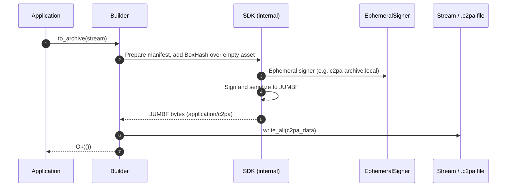
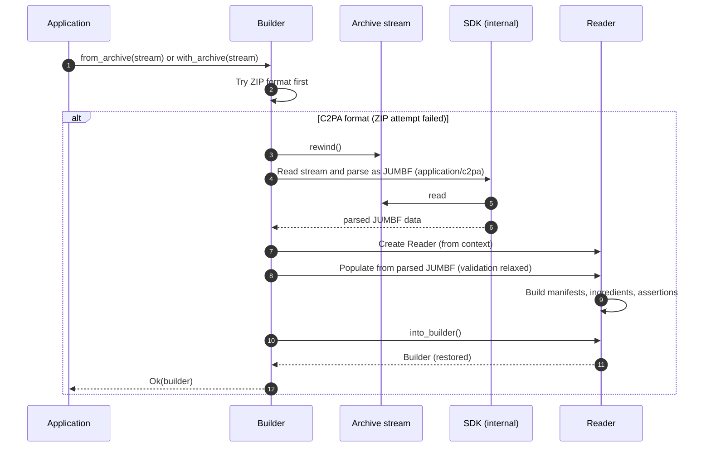

# Working stores and C2PA archives

This document explains how **working stores** and **C2PA archives** work in the SDK, how they relate to each other, and how to save and restore `Builder` state.

## Overview

“Working store” and “C2PA archive” refer to the same underlying concept:
- “Working store” emphasizes the editable state.
- “C2PA archive” emphasizes the saved, portable representation.

| Term | Emphasis |
|------|----------|
| **Working store** | The *content*: an editable C2PA manifest state (claims, ingredients, assertions) that has not yet been bound to a final asset. Often used when describing “work in progress” manifest data. |
| **C2PA archive** | The *artifact*: the saved bytes (in a `.c2pa` file or stream) from saving a working store that you can read back to restore a `Builder`. |

Both use the same standard JUMBF format (`application/c2pa`). A C2PA archive is simply a working store serialized as a normal C2PA manifest store. The specification does not define a separate archive format; the SDK reuses the standard manifest store format so that:

- The same format is used for **signed manifests** (bound to an asset), **working stores** (saved for later editing), and **saved ingredients** (e.g. validated once, reused in other manifests).
- An archive can be stored in a file, in the cloud, or saved as a sidecar `.c2pa` file.

Practical distinction:

- When you save a `Builder` with `to_archive()`, you produce a working store serialized as JUMBF `application/c2pa` (a C2PA archive).
- When you restore with `from_archive()` or `with_archive()`, you read that C2PA archive back into a `Builder` to continue editing. Note: you can’t merge working stores by calling `with_archive()` repeatedly.

### API summary

| Operation | API | Description |
|-----------|-----|-------------|
| Save | `builder.to_archive(&mut stream)` | Writes the working store to `stream`. By default, generates the current C2PA archive format. Use the setting `builder.generate_c2pa_archive = false` if you need the legacy ZIP format. |
| Restore to a new `Builder` | `Builder::from_archive(stream)` | Creates a default-context `Builder` and loads the archive into it. |
| Restore (existing context) | `builder.with_archive(stream)` | Loads the archive into an existing `Builder` (preserving its context). |

For more examples and patterns (for example, saving to a file, adding archived ingredients to a new manifest), see [Intents and archives](intents-and-archives.md) and [Content Credentials proposal](https://github.com/contentauth/c2pa-rs/blob/main/docs/content_credentials.md).

### Legacy ZIP archive format

The SDK also supports an older format: a ZIP file containing `manifest.json`, `resources/`, and `manifests/` (see [Settings](./settings.md)). This ZIP format is generated when `builder.generate_c2pa_archive = false`. When `builder.generate_c2pa_archive = true` (default), `to_archive()` writes the C2PA working-store format. Restore accepts both (`with_archive` / `from_archive`): it tries ZIP first, then falls back to the C2PA format.

## Saving a working store 

When using the C2PA archive format, saving a `Builder` does the following:

1. Prepares manifest data (assertions, ingredients, etc.) for signing.
2. Adds a BoxHash assertion over an empty asset (placeholder), so the manifest is not bound to real content.
3. Adds an ephemeral, self-signed signature for tamper detection only (not intended for public trust).
4. Serializes to JUMBF `application/c2pa` and writes to the output stream (for example, a file or `Vec<u8>`).

The resulting stream is the C2PA archive (the serialized working store).

The following sequence diagram shows the flow when `Builder::to_archive(stream)` is called.

## Restoring a working store

Restoring from a C2PA archive does the following:

1. Reads and parses the archive as JUMBF `application/c2pa`.
2. Creates a `Reader` and populates it from that stream. Note: trust checks are relaxed so the archive’s placeholder signature can be accepted.
3. Converts the `Reader` back into a `Builder` with `into_builder()`, so you can continue editing and later sign to a real asset.

The following sequence diagram shows the flow when `Builder::from_archive(stream)` or `with_archive(stream)` is called and the archive is in C2PA (JUMBF) format.

