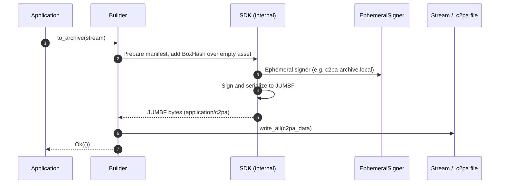
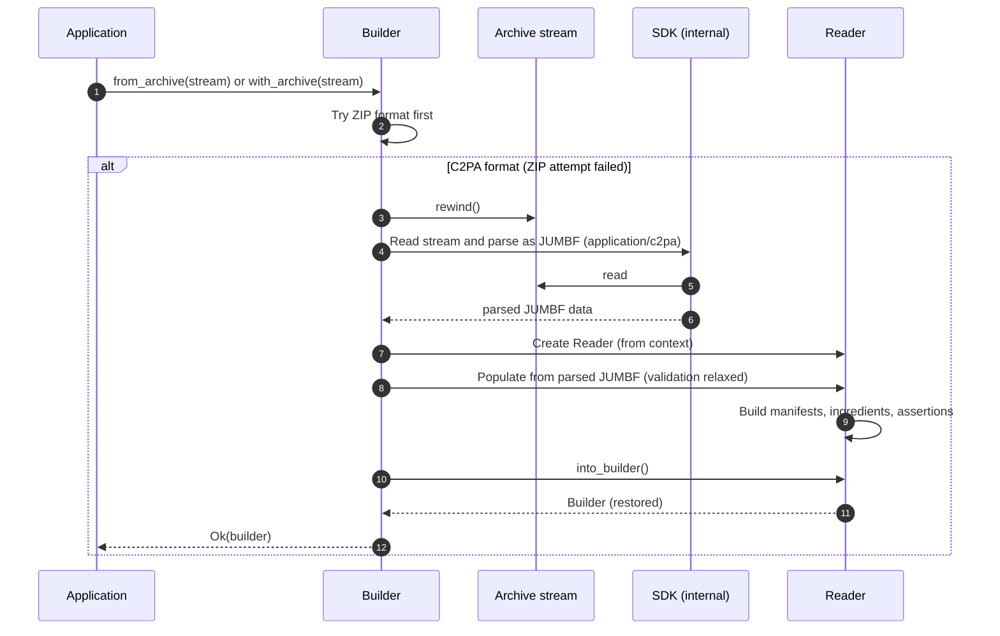

# Working stores and archives

Many workflows need to pause and resume manifest authoring or reuse previously validated ingredients. _Working stores_ and _C2PA archives_ (or simply _archives_) provide a standard way to save and restore this state of a [`Builder`](https://docs.rs/c2pa/latest/c2pa/struct.Builder.html).

## Overview

Working store and archive refer to the same underlying concept:
- **Working store** emphasizes the editable state, the *content* of the editable C2PA manifest state (claims, ingredients, assertions) that has not yet been bound to a final asset. Typically used when describing "work in progress" manifest data.
- **C2PA archive** emphasizes the saved, portable representation, the *artifact* of the saved bytes (in a `.c2pa` file or stream) resulting from a working store that you can read back to restore a `Builder`.

An archive is simply a working store serialized as a normal manifest store. 

Both use the standard JUMBF format (`application/c2pa`). The specification does not define a separate archive format; the SDK reuses the standard manifest store format:

- The same format is used for **signed manifests** (bound to an asset), **working stores** (saved for later editing), and **saved ingredients** (e.g. validated once, reused in other manifests).
- An archive can be embedded in files, stored as sidecars (for example, `.c2pa`), or kept in the cloud or a database.
- Unsigned working stores use placeholder signatures (`BoxHash`).
- Validate once, then reuse without re-validation.

Practical distinction:

- Saving a `Builder` with [`to_archive()`](https://docs.rs/c2pa/latest/c2pa/struct.Builder.html#method.to_archive) produces a working store serialized as JUMBF `application/c2pa` (an archive).
- Restoring it with [`from_archive()`](https://docs.rs/c2pa/latest/c2pa/struct.Builder.html#method.from_archive) or [`with_archive()`](https://docs.rs/c2pa/latest/c2pa/struct.Builder.html#method.with_archive) reads the archive back into a `Builder` to continue editing. 

> [!NOTE]
> You can't merge working stores by calling `with_archive()` repeatedly.

### API summary

| Operation | API | Description |
|-----------|-----|-------------|
| Save | [`builder.to_archive(&mut stream)`](https://docs.rs/c2pa/latest/c2pa/struct.Builder.html#method.to_archive) | Writes the working store to `stream`. By default, generates the current archive format. Use the [setting](context-settings.md) `builder.generate_c2pa_archive = false` to specify legacy ZIP format. |
| Restore to a new `Builder` | [`Builder::from_archive(stream)`](https://docs.rs/c2pa/latest/c2pa/struct.Builder.html#method.from_archive) | Creates a default-context `Builder` and loads the archive into it. |
| Restore (existing context) | [`builder.with_archive(stream)`](https://docs.rs/c2pa/latest/c2pa/struct.Builder.html#method.with_archive) | Loads the archive into an existing `Builder` (preserving its context). |

### Legacy ZIP archive format

The SDK also supports an older format: a ZIP file containing `manifest.json`, `resources/`, and `manifests/` (see [Settings](context-settings.md)). This ZIP format is generated when `builder.generate_c2pa_archive = false`. When `builder.generate_c2pa_archive = true` (default), `to_archive()` writes the C2PA working-store format. Restore accepts both (`with_archive` / `from_archive`): it tries ZIP first, then falls back to the C2PA format.

## Best practices

1. [**Use intents**](intents.md): Set an intent to get automatic validation and action generation.
2. [**Archive validated ingredients**](#capture-an-ingredient-as-an-archive-and-reuse-it): Save expensive validation results.
3. [**Use shared context**](context-settings.md): Create once, share across operations.
4. [**Label ingredients**](#link-ingredients-to-actions): Use labels to link ingredients to actions.
5. **Store archives flexibly**: Files, databases, and cloud storage all work.

## Examples

- [`sdk/examples/builder_sample.rs`](https://github.com/contentauth/c2pa-rs/blob/main/sdk/examples/builder_sample.rs)
- [`sdk/examples/api.rs`](https://github.com/contentauth/c2pa-rs/blob/main/sdk/examples/api.rs)

Run the builder example:

```bash
cd sdk
cargo run --example builder_sample
```

## Saving a working store

When using the archive format, saving a `Builder` does the following:

1. Prepares manifest data (assertions, ingredients, etc.) for signing.
2. Adds a BoxHash assertion over an empty asset (placeholder), so the manifest is not bound to real content.
3. Adds an ephemeral, self-signed signature for tamper detection only (not intended for public trust).
4. Serializes to JUMBF `application/c2pa` and writes to the output stream (for example, a file or `Vec<u8>`).

The resulting stream is the archive (the serialized working store).

The following sequence diagram shows the flow when `Builder::to_archive(stream)` is called.


```mermaid
sequenceDiagram
    autonumber
    participant App as Application
    participant Builder as Builder
    participant Internal as SDK (internal)
    participant Signer as EphemeralSigner
    participant Stream as Stream / .c2pa file

    App->>Builder: to_archive(stream)
    Builder->>Internal: Prepare manifest, add BoxHash over empty asset
    Internal->>Signer: Ephemeral signer (e.g. c2pa-archive.local)
    Internal->>Internal: Sign and serialize to JUMBF
    Internal-->>Builder: JUMBF bytes (application/c2pa)
    Builder->>Stream: write_all(c2pa_data)
    Builder-->>App: Ok(())
```

## Restoring a working store

Restoring from an archive does the following:

1. Reads and parses the archive as JUMBF `application/c2pa`.
2. Creates a `Reader` and populates it from that stream. Note: Trust checks are relaxed so the archive's placeholder signature can be accepted.
3. Converts the `Reader` back into a `Builder` with `into_builder()`, so you can continue editing and later sign to a real asset.

The following sequence diagram shows the flow when `Builder::from_archive(stream)` or `with_archive(stream)` is called and the archive is in C2PA (JUMBF) format.


```mermaid
sequenceDiagram
    autonumber
    participant App as Application
    participant Builder as Builder
    participant ArchiveStream as Archive stream
    participant Internal as SDK (internal)
    participant Reader as Reader

    App->>Builder: from_archive(stream) or with_archive(stream)
    Builder->>Builder: Try ZIP format first
    alt C2PA format (ZIP attempt failed)
        Builder->>ArchiveStream: rewind()
        Builder->>Internal: Read stream and parse as JUMBF (application/c2pa)
        Internal->>ArchiveStream: read
        Internal-->>Builder: parsed JUMBF data
        Builder->>Reader: Create Reader (from context)
        Builder->>Reader: Populate from parsed JUMBF (validation relaxed)
        Reader->>Reader: Build manifests, ingredients, assertions
        Builder->>Reader: into_builder()
        Reader-->>Builder: Builder (restored)
        Builder-->>App: Ok(builder)
    end
```

## Common tasks

### Save and restore a Builder

Use `to_archive()` to save a `Builder`:

```rust
pub fn to_archive(&mut self, mut stream: impl Write + Seek) -> Result<()>
```

For example:

```rust
// Save
let mut archive = Cursor::new(Vec::new());
builder.to_archive(&mut archive)?;
std::fs::write("work.c2pa", archive.get_ref())?;
```

Use `from_archive` to restore an archive using the default `Context`. Use `with_archive` to restore an archive using a custom shared `Context`:

```rust
pub fn from_archive(stream: impl Read + Seek + Send) -> Result<Self>
pub fn with_archive(self, stream: impl Read + Seek + Send) -> Result<Self>
```

```rust
// Restore (default context)
let builder = Builder::from_archive(Cursor::new(std::fs::read("work.c2pa")?))?;

// Or restore with a custom, shared context (see: docs/context-settings.md)
let builder = Builder::from_shared_context(&context)
    .with_archive(Cursor::new(std::fs::read("work.c2pa")?))?;
```

### Capture an ingredient as an archive and reuse it

```rust
// Capture and sign a C2PA-only archive (no embedded asset)
let signer = context.signer()?;
let ingredient_c2pa = builder.sign(
    signer,
    "application/c2pa",
    &mut io::empty(),
    &mut io::empty(),
)?;
```

This returns the raw C2PA manifest store as `Vec<u8>`.

Later, you can add that archived ingredient to a new manifest as follows:

```rust
let mut builder = Builder::from_shared_context(&context)
    .with_definition(
        json!({
            "title": "New Title", 
            "relationship": "componentOf" 
        }) 
    )?;

builder.add_ingredient_from_stream(
    json!({
        "title": "Archived Ingredient",
        "relationship": "componentOf",
        "label": "ingredient_1"
    })
    .to_string(),
    "application/c2pa",
    &mut Cursor::new(ingredient_c2pa),
)?;
builder.add_action(json!({
    "action": "c2pa.placed",
    "parameters": { "ingredientIds": ["ingredient_1"] }
}))?;
```

Calling [`add_ingredient_from_stream()`](https://docs.rs/c2pa/latest/c2pa/struct.Builder.html#method.add_ingredient_from_stream) with format `"application/c2pa"`:

1. Reads the archive.
2. Extracts the first ingredient from the active manifest.
3. Merges with provided JSON properties, but your overrides take precedence.

This ensures:
- No long chains of signed manifests.
- Better user experience.
- Support for iterative workflows.

### Override archived ingredient properties

JSON properties passed to `add_ingredient_from_stream()` override archived values:

```rust
builder.add_ingredient_from_stream(
    json!({
        "title": "New Title",           // Overrides archived title
        "relationship": "componentOf"   // Overrides archived relationship
    })
    .to_string(),
    "application/c2pa",
    &mut archived_stream,
)?;
```

For creating and sharing a `Context` (including using `Arc`), see: [Configuring the SDK using Context](context-settings.md).

### Link ingredients to actions

Use labels to reference ingredients in actions:

```rust
builder.add_action(json!({
    "action": "c2pa.placed",
    "parameters": {
        "ingredientIds": ["ingredient_1"],  // References the label
    }
}))?;
```

## FAQs

**Can I use both old and new archive formats?**

Yes. Loading an archive automatically detects supported formats.

**Can I modify an archived ingredient's properties?**

Yes. JSON properties passed to `add_ingredient_from_stream()` override archived values.

**Where should I store archives?**

Anywhere&mdash;Local files, S3, databases, and in-memory all work.

**Can I have multiple parent ingredients?**

No. Only one parent is allowed. Other ingredients use different relationships (for example, `componentOf`, `inputTo`).
