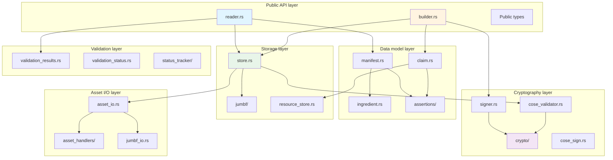
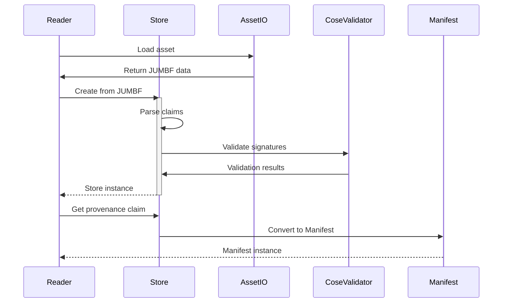
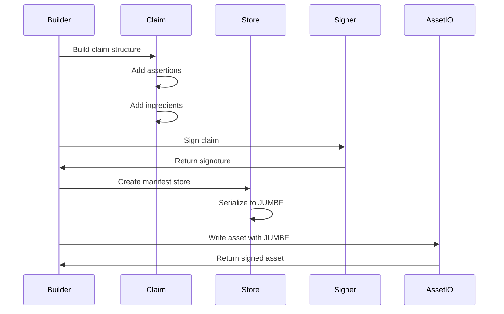

# C2PA SDK architecture

This document describes the outermost architectural layer of the c2pa SDK. The SDK implements the C2PA (Coalition for Content Provenance and Authenticity) specification, providing functionality to create, embed, read, and validate C2PA manifests in digital assets.

## Architectural overview

The SDK follows a layered architecture that separates concerns between public APIs, data models, storage, asset I/O, cryptography, and validation.

## Module organization

### Public API layer

The outermost layer provides high-level APIs for common workflows.

#### `Builder` ([builder.rs](builder.rs))

Creates and signs C2PA manifests. The `Builder` provides both declarative (JSON-based) and imperative (method-based) interfaces for constructing manifests.

##### Key responsibilities

- Assemble manifest definitions from ingredients, assertions, and resources
- Coordinate with signers to create cryptographic signatures
- Embed signed manifests into assets via asset handlers
- Support multiple signing workflows (standard, data-hashed, box-hashed)
- Archive and restore builder state

##### Depends on

- [`Claim`](#claim-claimrs)
- [`Store`](#store-storers)
- [`Signer`](#signer-and-asyncsigner-signerrs)
- [`asset_io.rs`](#asset_iors)
- [`ResourceStore`](#resourcestore-resource_storers)
- [`settings/`](#settings)

#### `Reader` ([reader.rs](reader.rs))

Reads and validates C2PA manifests from assets. The `Reader` extracts manifest stores, validates signatures and bindings, and provides access to manifest content.

##### Key responsibilities

- Extract JUMBF manifest stores from assets
- Validate cryptographic signatures and certificate chains
- Validate hard and soft bindings between manifest and asset
- Track and report validation status
- Support both sync and async validation workflows

##### Depends on

- [`Store`](#store-storers)
- [`Manifest`](#manifest-manifestrs)
- [`validation_results.rs`](#validation_resultsrs)
- [`status_tracker/`](#status_tracker)
- [`asset_io.rs`](#asset_iors)

#### Public type exports

The SDK exposes selected types from internal modules as public API:

- `Manifest`, `Ingredient`, `ManifestAssertion` (data model)
- `Signer`, `AsyncSigner`, `CallbackSigner` (signing interfaces)
- `ValidationResults`, `ValidationState` (validation results)
- `Error`, `Result` (error handling)
- Various assertion types from [`assertions/`](assertions/)

### Data model layer (internal)

Internal representations of C2PA structures.

#### `Claim` ([claim.rs](claim.rs))

The core internal representation of a C2PA claim. A claim is a set of assertions about an asset, including its provenance, along with signature information.

##### Key responsibilities

- Maintain claim structure (assertions, ingredients, signature)
- Manage assertion instances and uniqueness
- Handle redactions and assertion references
- Support claim versioning (v1, v2)
- Provide CBOR serialization/deserialization

##### Depends on

- [`Assertion`](#assertion-assertionrs)
- [`assertions/`](#assertions)
- [`hashed_uri.rs`](hashed_uri.rs)
- [`ResourceStore`](#resourcestore-resource_storers)

#### `Manifest` ([manifest.rs](manifest.rs))

Public representation of a validated C2PA manifest. Manifests are created from claims during validation.

##### Key responsibilities

- Present validated claim data in user-friendly format
- Provide assertion lookup and decoding
- Expose ingredient hierarchy
- Include signature information
- Support JSON serialization for reporting

##### Depends on

- [`Claim`](#claim-claimrs)
- [`Ingredient`](#ingredient-ingredientrs)
- [`assertions/`](#assertions)
- [`ResourceStore`](#resourcestore-resource_storers)

#### `Ingredient` ([ingredient.rs](ingredient.rs))

Represents a source asset (parent or component) used in creating the current asset. Ingredients can have their own C2PA provenance.

##### Key responsibilities

- Capture ingredient metadata (title, format, identifiers)
- Extract and validate ingredient manifests
- Support relationship types (parent, component, input)
- Handle ingredient resources (thumbnails, manifest data)
- Track ingredient validation results

##### Depends on

- [`Store`](#store-storers)
- [`assertions/`](#assertions)
- [`validation_results.rs`](#validation_resultsrs)
- [`ResourceStore`](#resourcestore-resource_storers)

#### `Assertion` ([assertion.rs](assertion.rs))

Base functionality for assertion handling, including encoding/decoding and validation.

##### Key responsibilities

- Define assertion trait for type-safe assertion handling
- Provide assertion serialization/deserialization (CBOR/JSON)
- Support assertion versioning
- Handle assertion decoding errors

##### Depends on

- [`assertions/`](#assertions)

#### [assertions/](assertions/)

A collection of modules implementing specific C2PA assertion types and custom extensions.

TO DO: Create [assertions/README.md](assertions/README.md) to describe assertion modules.

#### `ManifestAssertion` ([manifest_assertion.rs](manifest_assertion.rs))

Container for assertions within manifests, supporting multiple storage formats (CBOR, JSON, binary).

##### Key responsibilities

- Wrap assertion data with label and instance information
- Support different assertion kinds (CBOR, JSON, Binary, URI)
- Track created vs gathered assertions
- Provide type-safe assertion decoding

### Storage layer (internal)

Manages persistence and serialization of C2PA data.

#### `Store` ([store.rs](store.rs))

The internal manifest store that manages one or more claims and their relationships. This is the central hub for C2PA data before it's written to or after it's read from an asset.

##### Key responsibilities

- Manage claim graph (active claim, parent claims, update manifests)
- Handle JUMBF serialization/deserialization
- Coordinate validation across claims
- Support remote manifests
- Manage update manifest chains

##### Depends on

- [`Claim`](#claim-claimrs)
- [`jumbf/`](#jumbf)
- [`asset_io.rs`](#asset_iors)
- [`cose_validator.rs`](#cose_validatorrs)
- [`status_tracker/`](#status_tracker)

#### [jumbf/](jumbf/)

JUMBF (JPEG Universal Metadata Box Format) is the container format used to store C2PA data in assets. This module provides the box structure and label management.

TO DO: Create [jumbf/README.md](jumbf/README.md) to describe JUMBF modules.

#### `ResourceStore` ([resource_store.rs](resource_store.rs))

Manages binary resources like thumbnails, icons, and embedded ingredient data. Resources are referenced by URI and stored separately from assertions.

##### Key responsibilities

- Store and retrieve binary resources
- Generate unique resource identifiers
- Support both embedded and external resources
- Handle resource formats and MIME types
- Provide resource iteration and serialization

#### `ManifestPatchCallback` ([external_manifest.rs](external_manifest.rs))

Handles remote/external manifest references and manifest patching callbacks.

##### Key responsibilities

- Support manifest patch callbacks for external signing
- Handle remote manifest URLs
- Coordinate with HTTP resolvers for fetching

###### Depends on

- [`Claim`](#claim-claimrs)
- [`http/`](#http)

### Asset I/O layer

Handles format-specific reading and writing of assets with C2PA data.

#### [asset_io.rs](asset_io.rs)

Defines traits for asset I/O operations. These traits abstract over different asset formats, allowing the SDK to handle JPEG, PNG, MP4, and other formats uniformly.

##### Key traits

- `AssetIO` - Format detection and handler creation
- `CAIReader` - Read C2PA data from assets
- `CAIWriter` - Write C2PA data to assets
- `CAIReadWrite` - Combined read/write operations

##### Key responsibilities

- Define asset I/O interface
- Support streaming operations
- Handle hash object positions for hard bindings
- Coordinate with format-specific handlers

##### Depends on

- [`asset_handlers/`](#asset_handlers)
- [`jumbf/`](#jumbf)

#### [asset_handlers/](asset_handlers/)

Format-specific implementations for different asset types. Each handler knows how to read and write C2PA data for its format.

TO DO: Create [asset_handlers/README.md](asset_handlers/README.md) to describe asset handler modules.

#### [jumbf_io.rs](jumbf_io.rs)

High-level JUMBF I/O operations that coordinate between asset handlers and JUMBF serialization.

##### Key responsibilities

- Load JUMBF from asset streams (via appropriate handler)
- Save JUMBF to asset streams (via appropriate handler)
- Support multiple asset formats through handler registry
- Provide format detection

##### Depends on

- [`asset_handlers/`](#asset_handlers)
- [`jumbf/`](#jumbf)

### Cryptography layer

Handles all cryptographic operations including signing, validation, and certificate handling.

#### [crypto/](crypto/)

A module providing core cryptography primitives using either OpenSSL and Rust-native implementations.

TO DO: Create [asset_handlers/README.md](asset_handlers/README.md) to describe asset handler modules.

#### `Signer` and `AsyncSigner` ([signer.rs](signer.rs))

Defines the `Signer` and `AsyncSigner` traits that abstract over different signing implementations. This allows the SDK to work with various signing mechanisms (local keys, HSMs, remote services, etc.).

##### Key responsibilities

- Define signing interface
- Support multiple signing algorithms (RSA-PSS, ECDSA, EdDSA)
- Handle certificate chains
- Coordinate with timestamp authorities
- Support OCSP stapling
- Enable dynamic assertions during signing

##### Depends on

- [`crypto/`](#crypto)
- [`dynamic_assertion.rs`](#dynamic_assertionrs)

#### [create_signer.rs](create_signer.rs)

Factory functions for creating standard signer implementations from keys and certificates.

##### Key responsibilities

- Create signers from PEM files or byte arrays
- Support all standard signing algorithms
- Configure timestamp authority URLs
- Provide convenient signer construction

##### Depends on

- [`Signer`](#signer-and-asyncsigner-signerrs)
- [`crypto/`](#crypto)

#### [callback_signer.rs](callback_signer.rs)

A `Signer` implementation that delegates signing to user-provided callbacks. This enables integration with external signing systems.

##### Key responsibilities

- Wrap callback functions as `Signer` trait
- Support custom signing logic
- Enable HSM and remote signing workflows

##### Depends on

- [`Signer`](#signer-and-asyncsigner-signerrs)

#### [cose_sign.rs](cose_sign.rs)

High-level COSE signing operations. Coordinates between signers and COSE structures.

##### Key responsibilities

- Create COSE Sign1 structures
- Handle timestamp tokens
- Manage COSE headers and protected attributes
- Support direct COSE handling for advanced use cases

##### Depends on

- [`crypto/cose/`](crypto/cose/)
- [`Signer`](#signer-and-asyncsigner-signerrs)

#### [cose_validator.rs](cose_validator.rs)

Validates COSE signatures, certificates, and timestamp tokens.

##### Key responsibilities

- Verify COSE Sign1 signatures
- Validate certificate chains against trust anchors
- Verify timestamp tokens
- Check OCSP responses
- Apply trust policies and EKU requirements

##### Depends on

- [`crypto/cose/`](crypto/cose/)
- [`status_tracker/`](#status_tracker)
- [`settings/`](#settings)

### Validation layer

Tracks and reports validation results across all aspects of manifest validation.

#### [validation_results.rs](validation_results.rs)

Structured validation results following the C2PA specification's validation states.

##### Key responsibilities

- Define `ValidationState` enum (Invalid, Valid, Trusted)
- Track validation status codes (success, informational, failure)
- Support ingredient delta validation (changes from previous validation)
- Provide structured reporting for validation outcomes

##### Depends on

- [`validation_status.rs`](#validation_statusrs)
- [`status_tracker/`](#status_tracker)
- [`Store`](#store-storers)

#### [validation_status.rs](validation_status.rs)

Individual validation status codes as defined in the C2PA specification.

##### Key responsibilities

- Define all C2PA validation status codes
- Provide status code metadata (success/info/failure)
- Support status code URLs and documentation
- Enable filtering and categorization of validation issues

##### Depends on

- [`status_tracker/`](#status_tracker)

#### [status_tracker/](status_tracker/)

Internal tracking of validation and processing events during reading and signing.

##### Key components

- [`mod.rs`](status_tracker/mod.rs) - Main `StatusTracker` type
- [`log_item.rs`](status_tracker/log_item.rs) - Individual logged events

##### Key responsibilities

- Record validation events as they occur
- Support filtering by label/URI
- Provide event iteration and reporting
- Convert to public validation results

### Identity layer

[CAWG (Creator Assertions Working Group)](https://cawg.io) identity assertion support, including W3C Verifiable Credentials and X.509 credential binding.

TO DO: Create [identity/README.md](identity/README.md) to describe identity modules.

### Specialized modules

#### [dynamic_assertion.rs](dynamic_assertion.rs)

Support for assertions that are generated dynamically during the signing process. This allows signers to add assertions that depend on the final claim state.

##### Key responsibilities

- Define `DynamicAssertion` trait
- Support both sync and async dynamic assertions
- Provide partial claim information to dynamic assertions
- Enable runtime assertion generation

##### Depends on

- [`Claim`](#claim-claimrs)
- [`Signer`](#signer-and-asyncsigner-signerrs)

#### [http/](http/)

HTTP client abstractions supporting multiple backends for network operations (OCSP, remote manifests, timestamp authorities).

TO DO: Create [http/README.md](http/README.md) to describe HTTP-related modules.

### Supporting modules

#### [settings/](settings/)

SDK-wide configuration system using thread-local settings.

TO DO: Create [settings/README.md](settings/README.md) to describe settings-related modules.

#### `Error` and `Result` ([error.rs](error.rs))

Comprehensive error type covering all failure modes in the SDK.

##### Key responsibilities

- Define `Error` enum with all error variants
- Provide error conversions from dependencies
- Support error context and chaining
- Define `Result<T>` type alias

##### Error categories

- C2PA structure errors (claims, assertions, manifests)
- Cryptographic errors (signing, validation, certificates)
- Asset format errors
- I/O and network errors
- Validation rule violations

#### [utils/](utils/)

Collection of utility modules for common operations.

TO DO: Create [utils/README.md](utils/README.md) to describe utility modules.

#### Other support modules

- [`hashed_uri.rs`](hashed_uri.rs) - URI with hash for assertion references
- [`salt.rs`](salt.rs) - Salt generation for JUMBF box uniqueness
- [`claim_generator_info.rs`](claim_generator_info.rs) - Claim generator metadata
- [`manifest_store_report.rs`](manifest_store_report.rs) - Detailed validation reporting
- [`manifest_assertion.rs`](manifest_assertion.rs) - Assertion container in manifests

## Data flow

### Reading and validation flow

### Signing and embedding flow

