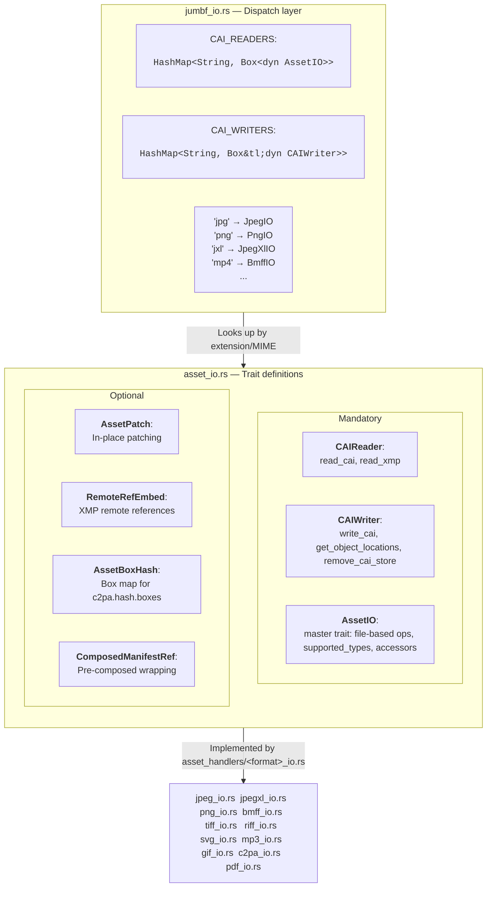

# Asset handler architecture guide

> [!NOTE]
> This documentation is primarily for SDK developers and contributors, not SDK users or consumers.

## How asset handlers work

The asset handler system follows a **trait-based plugin architecture** where each file format implements a set of traits defined in `asset_io.rs`, then gets registered in a central dispatch system in `jumbf_io.rs`.

## Dispatch layer

The system uses two `lazy_static` `HashMap`s that map file extension/MIME strings to handler instances:

- **`CAI_READERS`** — Maps every supported extension and MIME type to a `Box<dyn AssetIO>` handler instance. Used for reading manifests, getting object locations, and accessing optional capabilities.
- **`CAI_WRITERS`** — Maps every writable extension/MIME type to a `Box<dyn CAIWriter>` handler instance. Only populated for handlers that return `Some` from `get_writer()`.

At startup, each handler is instantiated, asked for its `supported_types()` (e.g., `["jpg", "jpeg", "image/jpeg"]`), and entries are created in the map for each type. When the SDK needs to process a file, it looks up the extension/MIME in the map and gets the appropriate handler.

### Lookup functions

| Function | Returns | Purpose |
|----------|---------|---------|
| `get_assetio_handler(ext)` | `Option<&dyn AssetIO>` | Full handler with all capabilities |
| `get_assetio_handler_from_path(path)` | `Option<&dyn AssetIO>` | Same, but extracts extension from file path |
| `get_cailoader_handler(asset_type)` | `Option<&dyn CAIReader>` | Stream-based reader only |
| `get_caiwriter_handler(asset_type)` | `Option<&dyn CAIWriter>` | Stream-based writer only |

### Public entry points

| Function | Description |
|----------|-------------|
| `load_jumbf_from_stream()` | Read JUMBF manifest from a stream |
| `load_jumbf_from_memory()` | Read JUMBF manifest from in-memory bytes |
| `load_jumbf_from_file()` | Read JUMBF manifest from a file path |
| `save_jumbf_to_stream()` | Write JUMBF manifest to a stream |
| `save_jumbf_to_memory()` | Write JUMBF manifest to in-memory bytes |
| `save_jumbf_to_file()` | Write JUMBF manifest to a file path |
| `remove_jumbf_from_file()` | Remove C2PA manifest from a file |
| `get_supported_types()` | List all supported extensions/MIME types |


## Trait hierarchy

There are **three mandatory traits** and **four optional traits** that a handler can implement.

### Mandatory traits

The mandatory traits are:

- [CAIReader](#caireader-) 
- [CAIWriter](#caiwriter) 
- [AssetIO](#assetio)

#### CAIReader 

Use `CAIReader` for stream-based reading:

```rust
pub trait CAIReader: Sync + Send {
    fn read_cai(&self, asset_reader: &mut dyn CAIRead) -> Result<Vec<u8>>;
    fn read_xmp(&self, asset_reader: &mut dyn CAIRead) -> Option<String>;
}
```

| Method | Responsibility |
|--------|---------------|
| `read_cai` | Extract the raw C2PA JUMBF manifest store bytes from a stream. Return `Error::JumbfNotFound` if none exists. Return `Error::TooManyManifestStores` if more than one manifest is detected. |
| `read_xmp` | Extract XMP metadata as a string. Return `None` if the format doesn't contain XMP or if no XMP is present. |

#### CAIWriter

Use `CAIWriter` for stream-based writing:

```rust
pub trait CAIWriter: Sync + Send {
    fn write_cai(
        &self,
        input_stream: &mut dyn CAIRead,
        output_stream: &mut dyn CAIReadWrite,
        store_bytes: &[u8],
    ) -> Result<()>;

    fn get_object_locations_from_stream(
        &self,
        input_stream: &mut dyn CAIRead,
    ) -> Result<Vec<HashObjectPositions>>;

    fn remove_cai_store_from_stream(
        &self,
        input_stream: &mut dyn CAIRead,
        output_stream: &mut dyn CAIReadWrite,
    ) -> Result<()>;
}
```

| Method | Responsibility |
|--------|---------------|
| `write_cai` | Read from input, embed `store_bytes` as the C2PA manifest, write the result to output. Must replace any existing manifest. The output must be a valid file of the same format. |
| `get_object_locations_from_stream` | Return the byte positions and lengths of key regions (CAI manifest, XMP, other) so the hashing system knows what to hash and what to exclude. If no manifest exists yet, insert a placeholder so the offset is known. |
| `remove_cai_store_from_stream` | Rewrite the asset without any C2PA manifest data. The output must remain a valid file. |

#### AssetIO — the master trait

`AssetIO` is the master trait:

```rust
pub trait AssetIO: Sync + Send {
    // Construction
    fn new(asset_type: &str) -> Self where Self: Sized;
    fn get_handler(&self, asset_type: &str) -> Box<dyn AssetIO>;

    // Reader/Writer access
    fn get_reader(&self) -> &dyn CAIReader;
    fn get_writer(&self, _asset_type: &str) -> Option<Box<dyn CAIWriter>> { None }

    // File-based operations
    fn read_cai_store(&self, asset_path: &Path) -> Result<Vec<u8>>;
    fn save_cai_store(&self, asset_path: &Path, store_bytes: &[u8]) -> Result<()>;
    fn get_object_locations(&self, asset_path: &Path) -> Result<Vec<HashObjectPositions>>;
    fn remove_cai_store(&self, asset_path: &Path) -> Result<()>;

    // Metadata
    fn supported_types(&self) -> &[&str];

    // Optional capability accessors (all default to None)
    fn asset_patch_ref(&self) -> Option<&dyn AssetPatch> { None }
    fn remote_ref_writer_ref(&self) -> Option<&dyn RemoteRefEmbed> { None }
    fn asset_box_hash_ref(&self) -> Option<&dyn AssetBoxHash> { None }
    fn composed_data_ref(&self) -> Option<&dyn ComposedManifestRef> { None }
}
```

The file-based methods (`read_cai_store`, `save_cai_store`, etc.) are thin wrappers that open files and delegate to the stream-based `CAIReader`/`CAIWriter` methods. The standard pattern is:

```rust
fn save_cai_store(&self, asset_path: &Path, store_bytes: &[u8]) -> Result<()> {
    let mut input_stream = std::fs::OpenOptions::new()
        .read(true).open(asset_path).map_err(Error::IoError)?;
    let mut temp_file = tempfile_builder("c2pa_temp")?;
    self.write_cai(&mut input_stream, &mut temp_file, store_bytes)?;
    rename_or_move(temp_file, asset_path)
}
```

### Optional traits

The optional traits are:

- [AssetPatch](#assetpatch) 
- [RemoteRefEmbed](#remoterefembed-) 
- [AssetBoxHash](#assetboxhash) 
- [ComposedManifestRef](#composedmanifestref)

#### AssetPatch

Use `AssetPatch`for in-place binary patching:

```rust
pub trait AssetPatch {
    fn patch_cai_store(&self, asset_path: &Path, store_bytes: &[u8]) -> Result<()>;
}
```

It optimizes manifest updates by patching bytes in-place without rewriting the whole file. Only works when the new store is the same size as the existing one. This is a performance optimization.

#### RemoteRefEmbed 

Use `RemoteRefEmbed` for remote manifest reference embedding:

```rust
pub trait RemoteRefEmbed {
    fn embed_reference(&self, asset_path: &Path, embed_ref: RemoteRefEmbedType) -> Result<()>;
    fn embed_reference_to_stream(
        &self,
        source_stream: &mut dyn CAIRead,
        output_stream: &mut dyn CAIReadWrite,
        embed_ref: RemoteRefEmbedType,
    ) -> Result<()>;
}
```

It embeds a remote manifest reference URL into the asset's XMP metadata. The `RemoteRefEmbedType` enum supports `Xmp`, `StegoS`, `StegoB`, and `Watermark` variants, though most handlers only implement `Xmp`.

#### AssetBoxHash

Use `AssetBoxHash` for box hash support:

```rust
pub trait AssetBoxHash {
    fn get_box_map(&self, input_stream: &mut dyn CAIRead) -> Result<Vec<BoxMap>>;
}
```

It generates a `BoxMap` describing all hashable regions in the file for `c2pa.hash.boxes` assertions. Each `BoxMap` entry contains:

```rust
pub struct BoxMap {
    pub names: Vec<String>,      // Box/segment name (e.g., "ftyp", "C2PA", "SOI")
    pub alg: Option<String>,     // Hash algorithm (filled by hashing system)
    pub hash: ByteBuf,           // Hash value (filled by hashing system)
    pub excluded: Option<bool>,  // Whether this region is excluded from hashing
    pub pad: ByteBuf,            // Padding (filled by hashing system)
    pub range_start: u64,        // Byte offset from start of file
    pub range_len: u64,          // Length in bytes
}
```

#### ComposedManifestRef 

Use `ComposedManifestRef` pre-composed manifest wrapping

```rust
pub trait ComposedManifestRef {
    fn compose_manifest(&self, manifest_data: &[u8], format: &str) -> Result<Vec<u8>>;
}
```

Wraps raw manifest store bytes into the format-specific container structure. For example:
- **JPEG**: Wraps into multi-segment APP11 data with JPEG XT headers
- **JPEG XL**: Wraps into a single ISOBMFF `jumb` superbox containing the C2PA manifest store
- **PNG**: Wraps into a `caBX` chunk with CRC

> [!NOTE] 
> The embeddable manifest API uses `ComposedManifestRef` to provide a composed manifest ready for direct insertion into an asset. When composed manifests are used, the asset handler is **not** performing the manifest embedding.

## Registration checklist

Adding a new handler requires touching exactly **four files**:

| Step | File | What to do |
|------|------|------------|
| 1 | `sdk/src/asset_handlers/mod.rs` | Add `pub mod your_format_io;` |
| 2 | `sdk/src/jumbf_io.rs` (imports) | Add `use crate::asset_handlers::your_format_io::YourFormatIO;` |
| 3 | `sdk/src/jumbf_io.rs` (registration) | Add `Box::new(YourFormatIO::new(""))` to both `CAI_READERS` and, if supported, `CAI_WRITERS` lazy_static blocks |
| 4 | `sdk/src/jumbf_io.rs` (tests) | Add handler to `test_get_assetio`, `test_get_reader`, `test_get_writer`; add extension to `test_get_supported_list`; add a `test_streams_yourformat` integration test |
| 5 | `docs/supported-formats.md` | Add to the supported formats table |


## Key behaviors and rules

### Format validation

Every handler must validate that the input is actually the expected format before processing. Return `Error::InvalidAsset` with a descriptive message on invalid input. Never silently produce corrupted output.

### Idempotent writes

`write_cai` must handle both:
- **Fresh assets** (no existing manifest) — insert new manifest at the correct location
- **Assets with existing manifests** — remove old manifest, insert new one

The output must always be a valid file of the original format.

### HashObjectPositions contract

The locations returned by `get_object_locations_from_stream` must:

- Be **non-overlapping** byte ranges
- Tag the C2PA manifest region as `HashBlockObjectType::Cai`
- Tag XMP regions as `HashBlockObjectType::Xmp`
- Tag everything else as `HashBlockObjectType::Other`
- If no manifest exists yet, create a placeholder so the hashing system knows where the manifest will go

```rust
pub struct HashObjectPositions {
    pub offset: usize,              // Byte offset from start of file
    pub length: usize,              // Length in bytes
    pub htype: HashBlockObjectType, // Cai, Xmp, Other, or OtherExclusion
}
```

### BoxMap contract

When implementing `AssetBoxHash`, the box map entries must:

- **Cover the contents of all boxes present in the file** — all boxes must be represented in the list
- **Be ordered by offset** — ascending `range_start`
- **Be non-overlapping** — no two entries share byte ranges
- **Label the C2PA manifest entry** with the constant name `C2PA_BOXHASH` (value: `"C2PA"`)
- Only populate `names`, `range_start`, and `range_len` — the hashing system fills in `hash`, `alg`, and `pad`

### Thread safety

All traits require `Sync + Send`. Handlers must be **stateless structs** with no mutable internal state. Pass configuration through the `asset_type` parameter to `new()`.

### Stream semantics

- All stream-based methods receive `&mut dyn CAIRead` (= `Read + Seek + Send`) for input
- Output streams use `&mut dyn CAIReadWrite` (= `Read + Seek + Write + Send`)
- Handlers should `rewind()` streams before reading
- Never assume the stream position on entry

### Error conventions

| Error | When to return |
|-------|---------------|
| `Error::JumbfNotFound` | No C2PA manifest exists in the asset |
| `Error::TooManyManifestStores` | More than one C2PA manifest detected |
| `Error::InvalidAsset(String)` | Input is corrupt or not the expected format |
| `Error::UnsupportedType` | Operation not supported for this format |
| `Error::EmbeddingError` | Failed to embed manifest into the asset |
| `Error::IoError(io::Error)` | Underlying I/O failure |

> [!NOTE] 
> Handlers may also return format-specific errors to provide more detailed diagnostics.


## Trait implementation matrix

| Handler | CAIReader | CAIWriter | AssetIO | RemoteRefEmbed | AssetBoxHash | ComposedManifestRef | AssetPatch |
|---------|:---------:|:---------:|:-------:|:--------------:|:------------:|:-------------------:|:----------:|
| **BmffIO** (MP4, HEIF, AVIF, MOV) | Y | Y | Y | Y | -- | -- | Y |
| **JpegIO** (JPG, JPEG) | Y | Y | Y | Y | Y | Y | -- |
| **JpegXlIO** (JXL) | Y | Y | Y | Y | Y | Y | -- |
| **PngIO** (PNG) | Y | Y | Y | Y | Y | Y | -- |
| **TiffIO** (TIF, TIFF, DNG) | Y | Y | Y | Y | -- | Y | Y |
| **RiffIO** (AVI, WAV, WEBP) | Y | Y | Y | Y | -- | -- | Y |
| **SvgIO** (SVG) | Y | Y | Y | Y | -- | -- | Y |
| **Mp3IO** (MP3) | Y | Y | Y | Y | -- | -- | Y |
| **GifIO** (GIF) | Y | Y | Y | Y | Y | Y | Y |
| **C2paIO** (C2PA sidecar) | Y | Y | Y | -- | Y | Y | -- |
| **PdfIO** (PDF) | Y | -- | Y | -- | -- | Y | -- |

### Key observations

- `CAIReader` + `AssetIO` are implemented by **every** handler (minimum requirement)
- `CAIWriter` is implemented by everything except PDF (which is currently read-only)
- `AssetPatch` is a performance optimization — formats that support it can update manifests in-place
- All traits are independent; format capabilities, as defined by the C2PA specification, determine which ones to implement


## Integration test pattern

Every handler should have a `test_streams_*` test in `jumbf_io.rs` that exercises two standard test harnesses:

### test_jumbf

Verifies the full round-trip:
1. Create a test C2PA store and sign it
2. Write JUMBF to the asset stream
3. Read JUMBF back from the output
4. Assert the read-back matches the original
5. Remove the C2PA store from the asset
6. Verify the manifest is gone (`Error::JumbfNotFound`)

### test_remote_ref

Verifies remote reference embedding (only applicable if the handler supports `RemoteRefEmbed`):
1. Get the `RemoteRefEmbed` from the handler
2. Embed an XMP remote URL into the asset if supported
3. Read XMP back from the output if supported
4. Extract provenance URL from the XMP
5. Assert it matches the original URL

### Example

```rust
#[test]
fn test_streams_jxl() {
    use crate::asset_handlers::jpegxl_io;
    let container = jpegxl_io::tests::build_test_jxl_container();
    let mut reader = Cursor::new(container);
    test_jumbf("jxl", &mut reader);
    reader.rewind().unwrap();
    test_remote_ref("jxl", &mut reader);
}
```

## Architectural diagram


